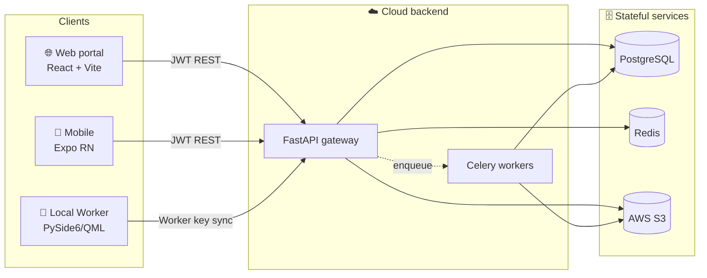
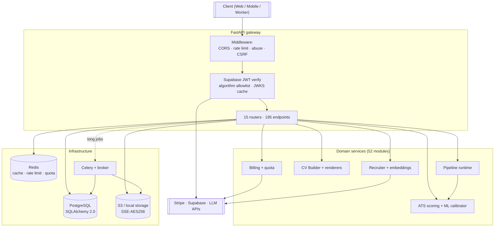
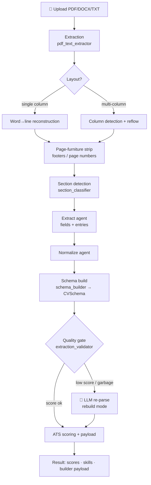
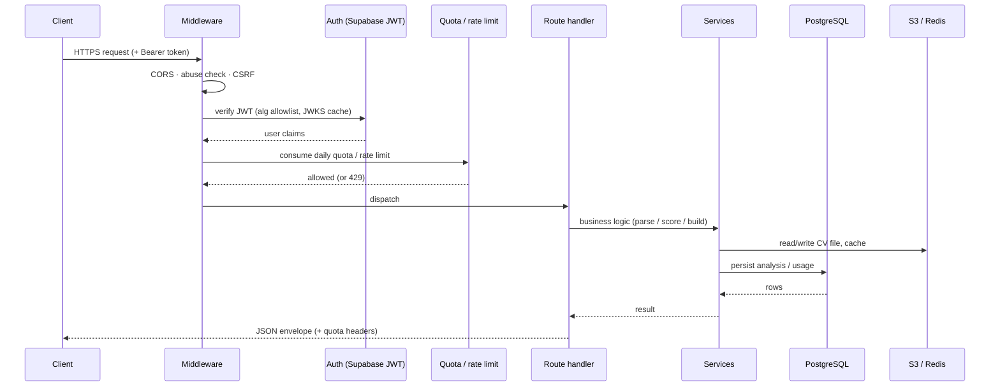
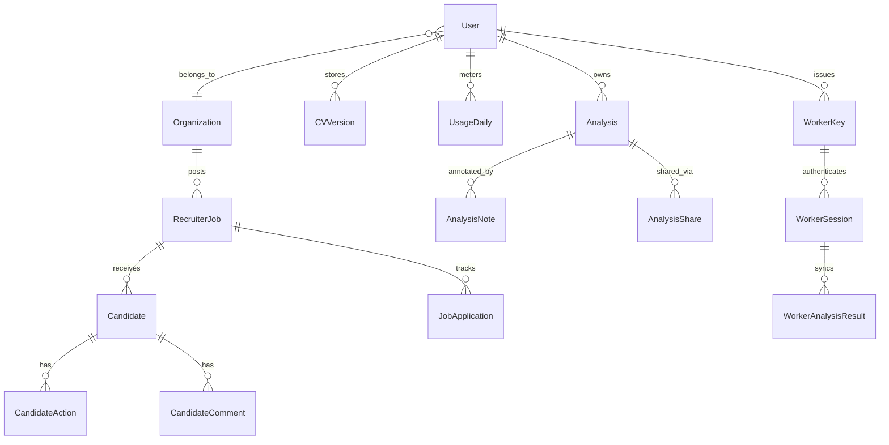
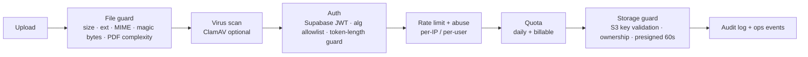
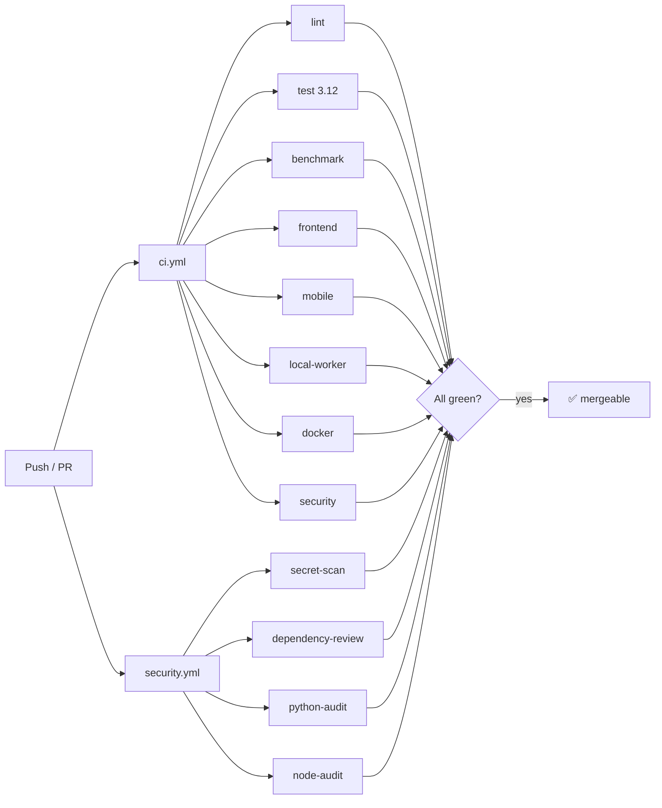
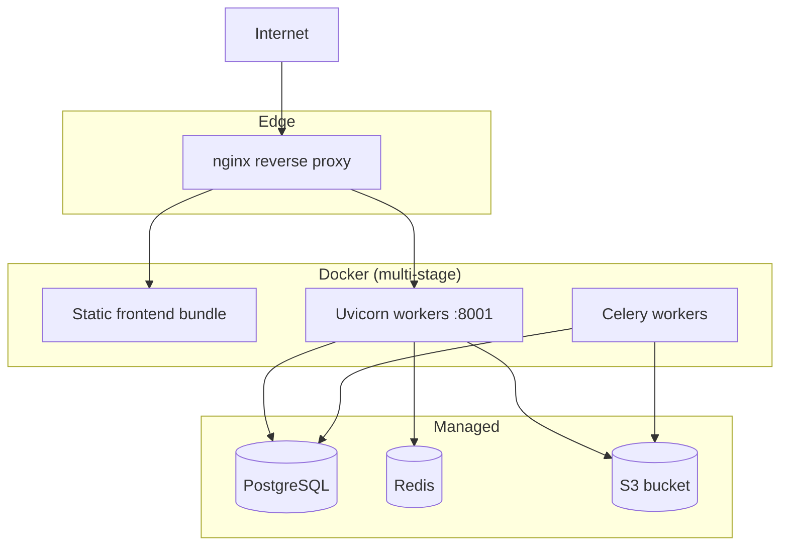

<div align="center">

# 🎯 CV Analyzer

### ATS calibration · resume intelligence · recruiter workflows · privacy-first local processing

*A hybrid SaaS + local-desktop platform built on a deterministic parsing core, using AI only where it earns its cost.*


[](README.md)&nbsp;&nbsp;

</div>

---

## 📑 Table of Contents

| # | Section | # | Section |
|---|---------|---|---------|
| 1 | [What is CV Analyzer](#-1-what-is-cv-analyzer) | 10 | [Data model](#-10-data-model) |
| 2 | [Feature matrix](#-2-feature-matrix) | 11 | [Security model](#-11-security-model) |
| 3 | [Quick start](#-3-quick-start) | 12 | [Environment variables](#-12-environment-variables) |
| 4 | [System architecture](#-4-system-architecture) | 13 | [Local development](#-13-local-development) |
| 5 | [Technology stack](#-5-technology-stack) | 14 | [Testing & quality gates](#-14-testing--quality-gates) |
| 6 | [Repository map](#-6-repository-map) | 15 | [CI/CD](#-15-cicd) |
| 7 | [Parsing pipeline](#-7-parsing-pipeline) | 16 | [Deployment](#-16-deployment) |
| 8 | [Request lifecycle](#-8-request-lifecycle) | 17 | [Roadmap & technical debt](#-17-roadmap--technical-debt) |
| 9 | [API surface](#-9-api-surface) | 18 | [Contributing & license](#-18-contributing--license) |

---

## 🧭 1. What is CV Analyzer

CV Analyzer **parses, scores, rewrites, and benchmarks résumés** against applicant-tracking-system (ATS) criteria.

The core design decision is **deterministic first, AI only when needed.** Rules and heuristics handle the bulk of résumés cheaply; the language model is invoked only when a confidence gate detects a low-quality parse. This keeps token spend proportional to difficulty.

The system is composed of **four cooperating runtimes** that share one domain model:

| Runtime | Technology | Responsibility |
|---------|-----------|----------------|
| 🖥️ **Backend API** | FastAPI (ASGI) | REST gateway, parsing pipeline, ATS scoring, billing, auth, quotas, storage, worker sync |
| 🌐 **Web portal** | React 18 + Vite | Landing, dashboards, analysis, CV Builder, recruiter workspace, billing UI |
| 📱 **Mobile client** | Expo React Native | Upload + history scaffold for on-the-go use |
| 🔐 **Local Worker** | PySide6 / Qt Quick (QML) | Offline batch processing on the user's own machine; explicit sync only |

The product direction is **hybrid SaaS + local privacy**: the cloud handles accounts, billing, recruiter collaboration, and shared workflows, while the Local Worker keeps sensitive batch processing on the user's machine until a sync is explicitly requested.



---

## ✨ 2. Feature matrix

### 👤 Candidate / individual

| Feature | Description |
|---------|-------------|
| ATS analysis | Upload PDF/DOCX/TXT → overall + per-section ATS scores, detected/missing skills, recommendations |
| Score breakdown | Structure, keywords, experience, education, languages, ATS-friendliness, length |
| AI auto-fix | Deterministic résumé repair first; LLM rewrite only when parse quality is low or a rebuild is requested |
| CV Builder | Template-based generation (DOCX / PDF / HTML / Typst) with plan-gated templates and fonts |
| Cover letters & interview prep | LLM-assisted cover-letter, interview-question, and answer-evaluation tools |
| History & sharing | Persisted analyses, notes, favorites, shareable tokens |

### 🧑‍💼 Recruiter / hiring

| Feature | Description |
|---------|-------------|
| Jobs & batches | Create jobs, upload job descriptions, ingest candidate batches |
| Candidate ranking | Semantic + keyword match scoring, shortlist probability, strengths/concerns |
| Decisions & reports | Candidate actions, comments, reminders, exportable reports |
| Embeddings search | Index CVs, find similar candidates, semantic search |
| Local processing | Issue worker keys; process privately; sync selected results back |

### 🔐 Local desktop

| Feature | Description |
|---------|-------------|
| Folder batch | Process local folders of PDF/DOCX/TXT résumés offline-first |
| Local exports | CSV / JSON / HTML outputs stored in a local workspace |
| Credential safety | API keys stored in OS credential storage where available |
| Explicit sync | Results never leave the machine until the user syncs |

---

## 🚀 3. Quick start

> **Prerequisites:** Python 3.12, Node.js 20+, optionally PostgreSQL 15+ and Redis 7. For development, SQLite and local-disk storage are enough.

```bash
# 1) Clone
git clone https://github.com/SercanOzkan55/CV-Analyzer.git
cd CV-Analyzer

# 2) Prepare env
cp .env.example .env          # Windows: copy .env.example .env

# 3) Backend
python -m venv venv
source venv/bin/activate      # Windows: venv\Scripts\activate
pip install -r requirements.txt
alembic upgrade head
uvicorn main:app --reload --port 8001

# 4) Frontend (in a second terminal)
cd frontend
cp .env.example .env          # Windows: copy .env.example .env
npm install
npm run dev
```

The backend serves on `http://localhost:8001` and the web portal on `http://localhost:3000`.

> ⚠️ **Port 8001 is required.** The frontend's Vite proxy forwards `/api` to `http://127.0.0.1:8001` (`frontend/vite.config.mjs`), and the `Dockerfile` exposes 8001. Running the backend on any other port breaks every API call from the UI.

---

## 🏗️ 4. System architecture



### Design patterns in play

| Pattern | Where |
|---------|-------|
| **Repository / service layer** | `services/*` encapsulate data access + business logic behind route handlers |
| **Factory** | `ai_client_factory`; extraction handler selection by file type / layout |
| **Strategy** | Storage adapter (local vs S3), fix mode (preserve / light-fix / rebuild) |
| **Singleton** | DB session factory, Redis clients, loaded ML models, runtime settings |
| **Pipeline** | `extract → normalize → schema → validate → score` staged transform |
| **Circuit breaker / kill-switch** | `core/ops_runtime`, `shared._cb_*` guard external dependencies |

---

## 🧰 5. Technology stack

### Backend

| Layer | Library | Version |
|-------|---------|---------|
| Web framework | FastAPI | `0.135.1` |
| ASGI server | Uvicorn | `0.42.0` |
| ORM | SQLAlchemy | `2.0.47` |
| Migrations | Alembic | `1.18.4` |
| Validation | Pydantic | `2.12.5` |
| Task queue | Celery | `5.6.2` |
| Cache / limits | redis-py | `7.2.1` |
| Object storage | boto3 (S3) | `1.42.73` |
| PDF extraction | pdfplumber / pypdf / pypdfium2 | `0.11.9` / `6.16.2` / `5.6.0` |
| ML scoring | scikit-learn / XGBoost / NumPy | `1.8.0` / `3.2.0` / `2.4.2` |
| JWT | PyJWT | `2.13.0` |
| DB driver | psycopg2-binary | `2.9.11` |

### Frontend / mobile / desktop

| Layer | Library | Version |
|-------|---------|---------|
| UI library | React | `18.2` |
| Build tool | Vite | `8.0` |
| Styling | Tailwind CSS | `4.3` |
| Animation | Framer Motion | `12.36` |
| Routing | React Router DOM | `6.21` |
| Auth client | Supabase JS | `2.39` |
| Testing | Vitest + Testing Library | `4.1` |
| Mobile | Expo / React Native | — |
| Desktop | PySide6 (Qt Quick / QML) | — |

---

## 🗂️ 6. Repository map

```text
CV-Analyzer/
├── main.py                 # FastAPI app bootstrap (routers, middleware, lifespan)
├── routes/                 # 15 routers, 195 endpoints
│   ├── analysis.py         #   ATS analyze (sync/async/pdf), ownership
│   ├── ai_tools.py         #   auto-fix, rewrite, cover letter, interview, embeddings
│   ├── cv_builder.py       #   templates, preview, generate, suggest-summary
│   ├── cv_storage.py       #   S3 upload/download/delete, score breakdown
│   ├── billing.py          #   Stripe checkout, webhooks, admin ops
│   ├── recruiter*.py       #   jobs, candidates, ranking, local sync (3 files)
│   ├── dashboard.py        #   usage, plan, stats
│   ├── user_data.py        #   user data, export, deletion (GDPR)
│   ├── owner_workflow.py   #   owner / operator workflows
│   ├── worker.py           #   local-worker claim/sync
│   ├── downloads.py        #   generated-file downloads
│   ├── blog.py             #   blog content (feature-flagged off)
│   └── system.py           #   health, readiness, ops
├── services/               # 52 domain services (see §7)
│   ├── pdf_text_extractor.py   # layout-aware PDF → text
│   ├── section_classifier.py   # language-agnostic section detection
│   ├── schema_builder.py       # normalized data → strict CVSchema
│   ├── extraction_validator.py # parse-quality gate → AI fallback
│   ├── cv_autofix_service.py   # deterministic repair + AI rewrite orchestration
│   ├── ats_scoring.py          # section + overall ATS scoring
│   └── ...
├── agents/                 # extract_agent, normalize_agent (pipeline stages)
├── core/                   # http_runtime, ops_runtime, quota, metrics, route_dependencies
├── models.py               # 35 SQLAlchemy models
├── schemas/                # Pydantic + CVSchema / CVModel
├── renderers/              # DOCX / PDF / HTML / Typst template engines
├── security/               # file_guard, s3_guard, rate_limit, runtime_guard
├── middleware/             # request middleware
├── alembic/ · migrations/  # DB migrations
├── frontend/               # React + Vite web portal
├── mobile/                 # Expo React Native scaffold
├── local_worker/           # PySide6 desktop app
├── tests/                  # 125 test files, 981 tests, golden fixtures
└── .github/workflows/      # CI: ci.yml · security.yml · build-local-worker.yml
```

---

## ⚙️ 7. Parsing pipeline

The parsing core is **deterministic-first**. The LLM is invoked **only** when a confidence gate detects a low-quality parse.



### Pipeline stages & key services

| Stage | Service(s) | What it does |
|-------|-----------|--------------|
| **Extract** | `pdf_text_extractor` | Font-relative word tolerance (`x_tolerance_ratio`) so tightly-spaced PDFs don't glue words; multi-column detection & reflow; mojibake repair; **page-furniture stripping** (footers / `Page N` / template credits) |
| **Classify** | `section_classifier`, `section_resolver` | Language-agnostic section detection via aliases + structural signals; qualifier-aware headers (`Research Experience`, `Other Work Experience`) |
| **Extract fields** | `agents/extract_agent` | Splits contact, summary, experiences (one entry per job), education, skills, projects, certifications, languages |
| **Normalize** | `agents/normalize_agent` | Canonicalizes dates, bullets, casing, ordering |
| **Schema** | `schema_builder` | Maps normalized data into a strict `CVSchema`; bullet-glyph normalization (`●○◦…`); routes spoken languages to the languages field; drops substance-less entries |
| **Validate** | `extraction_validator` | **Quality gate** — detects garbage parses (fragment titles, over-split tables, lost sections, garbage skills) and flips `needs_llm_fallback` |
| **Score** | `ats_scoring`, `ml_calibrator`, `scoring_service` | Per-section + overall ATS scores; ML calibration with confidence |
| **Build** | `cv_builder_service`, `renderers/*` | Template rendering to DOCX / PDF / HTML / Typst |

### Robustness highlights

| Problem | Fix |
|---------|-----|
| Glued words in tight PDFs (`BachelorofScience`) | Font-relative `x_tolerance_ratio` word splitting |
| `●`-bulleted jobs collapsing into one entry | Added `●○◦` + glyphs to all bullet regexes → correct per-job splitting |
| Page footers becoming fake jobs | Page-furniture stripping at extraction time |
| Spoken languages stuck in skills | Language-name / CEFR-gated routing into the languages field |
| Table & non-standard layouts shredding into garbage | **Fragmentation quality gate** routes them to LLM re-parse |

---

## 🔄 8. Request lifecycle



---

## 🌐 9. API surface

**15 routers, 195 endpoints**, all under `/api/v1`.

| Router | Endpoints | Purpose |
|--------|----------:|---------|
| `recruiter` | 26 | Recruiter workspace: jobs, candidates, ranking, reports |
| `ai_tools` | 24 | Auto-fix, rewrite, cover letter, interview, semantic search, embeddings |
| `dashboard` | 21 | Usage, plan, statistics |
| `worker` | 19 | Local Worker claim / sync |
| `owner_workflow` | 18 | Owner and operator workflows |
| `user_data` | 15 | User data, export, deletion (GDPR) |
| `system` | 15 | Health, readiness, ops endpoints |
| `billing` | 14 | Stripe checkout, webhooks, admin operations |
| `analysis` | 13 | ATS analysis (sync, async, file) |
| `recruiter_local` | 9 | Recruiter-side local-processing bridge |
| `cv_builder` | 6 | Template-based CV generation |
| `cv_storage` | 5 | S3 CV storage + score breakdown |
| `blog` | 5 | Blog content (off via `VITE_ENABLE_BLOG`) |
| `recruiter_extended` | 3 | Extended recruiter operations |
| `downloads` | 2 | Generated-file downloads |

> Responses use a consistent envelope (status, data, error, optional pagination meta) and carry quota headers.

---

## 🗃️ 10. Data model

35 SQLAlchemy models. Core relationships:



| Domain | Models |
|--------|--------|
| Accounts & billing | `User`, `Organization`, `APISubscription`, `RolePermission`, `QuotaEvent`, `UsageDaily` |
| Analysis | `Analysis`, `CVVersion`, `AnalysisNote`, `AnalysisShare`, `Favorite` |
| Recruiter | `RecruiterJob`, `Candidate`, `Job`, `JobApplication`, `CandidateAction`, `CandidateComment`, `Reminder`, `JobTemplate`, `EmailTemplate` |
| Benchmarks | `ATSBenchmarkGlobal`, `ATSBenchmarkProfession`, `ATSBenchmarkScore` |
| Local worker | `WorkerKey`, `WorkerSession`, `WorkerClaim`, `WorkerAnalysisResult` |
| Ops | `AuditLog`, `FailedTask`, `AsyncTaskOwner` |

---

## 🛡️ 11. Security model



| Layer | Control |
|-------|---------|
| Input | File size/extension/MIME/magic-byte validation, PDF complexity limits, optional ClamAV |
| Auth | Supabase JWT with algorithm allowlist, JWKS caching, token-length guard |
| Abuse | Per-IP & per-user rate limits, abuse bans, duplicate-request dedup |
| Quota | Daily + monthly plan limits, billable usage metering, cost guards |
| Storage | S3 SSE-AES256, key-format validation, ownership enforcement, 60s presigned URLs |
| Secrets | Env-var / secret-manager only; **Gitleaks** secret scan in CI |
| Supply chain | `pip-audit` + `npm audit` (root/frontend/mobile) + Dependency Review in CI |
| Billing | Stripe webhook HMAC signature verification |

---

## 🔑 12. Environment variables

`.env.example` defines **176 variables** — see that file for the full list and defaults. Never commit secrets; required values are validated at startup.

### Backend (`.env`)

| Group | Sample variables | Purpose |
|-------|------------------|---------|
| Core | `PORT`, `ENV`, `APP_TIMEZONE`, `BUILD_ID`, `GIT_SHA` | Runtime identity and metadata |
| Database | `DATABASE_URL` | PostgreSQL connection (SQLite for dev) |
| Cache | `REDIS_URL` | Cache, rate limiting, quota counters |
| Auth | `SUPABASE_URL`, `SUPABASE_JWT_*` | JWT verification / JWKS |
| Billing | `STRIPE_API_KEY`, `STRIPE_WEBHOOK_SECRET`, `BILLING_ADMIN_TOKEN` | Stripe and webhook verification |
| Storage | `STORAGE_BACKEND`, `AWS_*`, `S3_BUCKET`, `AWS_USE_IAM_ROLE` | Object storage (`s3` or `local`) |
| Rate limits | `RATE_LIMIT_IP_*`, `RATE_LIMIT_USER_*`, `ADMIN_RATE_LIMIT_PER_MIN` | Request ceilings |
| Abuse | `ABUSE_PROTECTION_ENABLED`, `ABUSE_BAN_SECONDS`, `ABUSE_SCORE_*` | Abuse detection and bans |
| Quota / plans | `ENTITLE_FREE_DAILY_CV`, `ENTITLE_PRO_DAILY_CV`, `ENTITLE_ENTERPRISE_DAILY_CV`, `AUTO_NEW_USER_PLAN` | Plan entitlements |
| Concurrency | `CONCURRENCY_ANALYZE`, `CONCURRENCY_EMBED`, `CONCURRENCY_REWRITE`, … | Per-stage concurrency caps |
| AI | `AI_TIMEOUT_SECONDS`, `AI_MAX_RETRIES`, `ENABLE_AI_REVIEW`, `AI_FINAL_REVIEW_ATS_THRESHOLD` | LLM behavior and cost guards |
| ATS | `ATS_MODEL_PATH`, `ATS_CONFIG_PATH`, `ATS_WEIGHT`, `ENABLE_CLASSIFIER` | Scoring model and weights |
| Retention | `CV_RETENTION_DAYS`, `CV_RETENTION_BATCH_LIMIT`, `CV_VERSION_TEXT_STORAGE_MODE` | Data retention policy |
| Security toggles | `CSRF_PROTECTION_ENABLED`, `CLAMAV_ENABLED`, `ADMIN_TOKEN`, `ADMIN_IP_ALLOWLIST` | Security switches |
| Backups | `BACKUP_DIR`, `BACKUP_RETENTION_DAYS`, `BACKUP_S3_PREFIX` | Backup jobs |
| Circuit breaker | `CB_FAILURE_THRESHOLD`, `CB_COOLDOWN_SECONDS` | External-dependency protection |

### Frontend (`frontend/.env`)

| Variable | Purpose |
|----------|---------|
| `VITE_API_BASE` | Backend base URL (production) |
| `VITE_SUPABASE_URL`, `VITE_SUPABASE_KEY` | Supabase client credentials |
| `VITE_PRIVATE_MODE` | Locks the site behind login, disables registration |
| `VITE_REGISTRATION_DISABLED` | Disables registration independently |
| `VITE_ENABLE_BLOG` | Blog is localStorage-only demo content — keep off until it has a real backend |
| `VITE_ENABLE_BILLING` | Checkout and billing portal stay hidden until Stripe production is ready |

---

## 💻 13. Local development

### Backend

```bash
python -m venv venv && source venv/bin/activate   # Windows: venv\Scripts\activate
pip install -r requirements.txt
alembic upgrade head
uvicorn main:app --reload --port 8001
```

### Frontend

```bash
cd frontend
npm install
npm run dev          # Vite dev server (port 3000)
npm run build        # production bundle + SEO prerender
npm run preview      # serve the production bundle locally
```

### Background workers (optional)

```bash
celery -A services.tasks worker --loglevel=info
```

### Local Worker (desktop)

```bash
cd local_worker
pip install -r requirements.txt
python main.py       # PySide6 / Qt Quick app
```

---

## 🧪 14. Testing & quality gates

| Suite | Command | Coverage |
|-------|---------|----------|
| Backend | `pytest tests/ -q` | **981 tests** across 125 files: parsing, scoring, schema, security, tenancy, billing |
| Golden CVs | `pytest tests/golden/` | Regression fixtures for known résumé shapes |
| Frontend | `cd frontend && npm test` | **129 tests** across 24 files (Vitest + Testing Library) |
| Frontend types | `cd frontend && npm run typecheck` | `tsc --noEmit` |
| Lint | `ruff check . --select E9,F63,F7,F82` | Syntax / undefined-name gate |
| Format | `ruff format --check .` | Code style |

---

## 🔁 15. CI/CD



Every PR is gated by **12 checks**:

| Workflow | Jobs |
|----------|------|
| `ci.yml` | `lint`, `test (3.12)`, `benchmark`, `frontend`, `mobile`, `local-worker`, `docker`, `security` |
| `security.yml` | `secret-scan` (Gitleaks), `dependency-review`, `python-audit` (pip-audit), `node-audit` (npm audit) |
| `build-local-worker.yml` | `build` — manual only (`workflow_dispatch`) |

---

## 🚀 16. Deployment



- **Multi-stage Docker** build produces a slim runtime image; the frontend is built and served as static assets behind **nginx**. The container exposes port **8001**.
- Database migrations run via **Alembic** (`alembic upgrade head`) on release.
- Storage backend is swappable (`STORAGE_BACKEND=local|s3`).
- Detailed guides: [`docs/deploy.md`](docs/deploy.md), [`docs/aws-deploy.md`](docs/aws-deploy.md), [`docs/aws-edge-security.md`](docs/aws-edge-security.md), [`docs/backup-restore.md`](docs/backup-restore.md).

---

## 🗺️ 17. Roadmap & technical debt

| Item | Status |
|------|--------|
| Multi-job experience splitting (sub-section headers) | ✅ Fixed (per-job entries) |
| Page-furniture / footer noise removal | ✅ Fixed |
| Parse-quality → AI fallback gate | ✅ Added (routes shredded layouts to LLM) |
| Table-layout CV parsing | 🔶 Deterministic parser weak; covered via AI fallback |
| Embedded date splitting (`June 2024 to September 2024` → start/end) | 🔶 Planned |
| Non-experience sections (`Leadership Activities`) routed into experience | 🔶 Planned |
| `core/route_dependencies` legacy mutable-state migration | 🔶 In progress |
| `datetime.utcnow()` → timezone-aware migration | 🔶 Backlog |

---

## 🤝 18. Contributing & license

### Contributing

1. **Branch** off `main` (`feat/...`, `fix/...`, `refactor/...`).
2. **TDD** — write/adjust tests first; keep ≥80% coverage on touched code.
3. **Lint & format** — `ruff check` + `ruff format` must pass.
4. **Scoped commits** — conventional-commit style (`feat:`, `fix:`, `refactor:`…); stage only related files.
5. **PR** — ensure all 12 CI checks are green before requesting review.

### License

Released under the **MIT License**. Copyright (c) 2026 Sercan Ozkan.

You are free to use, copy, modify, merge, publish, distribute, sublicense, and sell the software, provided the copyright and license notice is preserved. See [LICENSE](LICENSE) for the full text.

---

<div align="center">

**CV Analyzer** — deterministic where it can be, AI where it must be.

[Türkçe dokümantasyon →](README.md)

</div>
