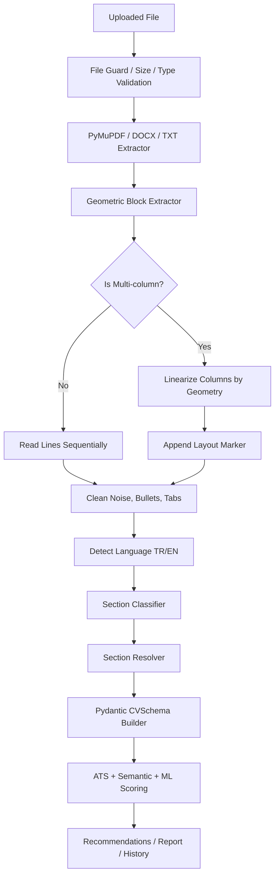
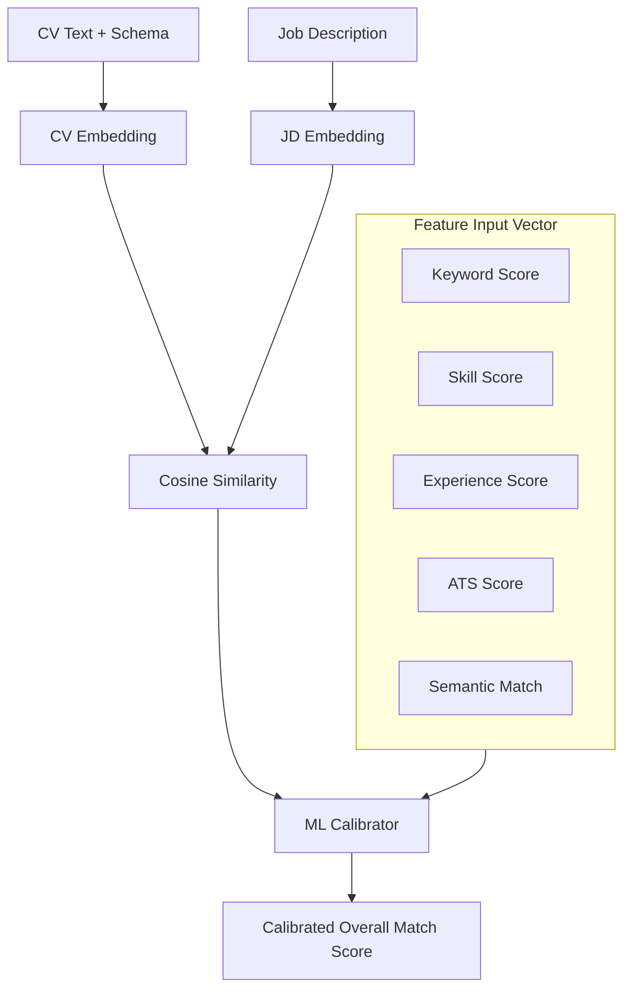

# CV Analyzer: Enterprise-Grade Resume Intelligence, ATS Calibration, and Local Desktop Processing Grid

CV Analyzer is a production-ready AI resume intelligence, applicant screening, ATS calibration, recruiter workflow, and local desktop processing platform. The codebase combines:

1. **FastAPI Backend Server Node:** ASGI web server for REST endpoints, database access, Stripe billing, Supabase JWT authentication, quota enforcement, storage adapters, worker sync, and scoring services.
2. **Vite + React 18 Web Portal:** Responsive SaaS portal with animated landing pages, dashboards, CV analysis, CV Builder, recruiter workspaces, feedback, billing, and analytics-oriented UI flows.
3. **Expo React Native Mobile Scaffold:** Mobile client scaffold prepared for CV upload and history tracking flows.
4. **PySide6 Qt Quick/QML Local Worker:** Native desktop application for private local CV folder processing, offline-first workspace storage, local exports, and explicit website sync.

The current product direction is hybrid SaaS plus local privacy. The website handles account, billing, recruiter, and cloud workflows; the Local Worker keeps sensitive batch processing on the user's own machine until sync is explicitly requested.

- Web users can upload CVs, analyze ATS fit, build CVs, manage history, use recruiter tools, and manage premium/billing flows.
- Recruiters can create jobs, upload or sync batches, rank candidates, review decisions, and generate reports.
- Local Worker users can process CV folders on their own machine and explicitly sync selected results back to the website.
- Security controls are layered across file validation, request limits, auth, quota enforcement, storage guards, audit tests, and dependency scanning.

---

## Table of Contents

1. [Product Scope](#product-scope)
2. [Architecture](#architecture)
3. [Repository Map](#repository-map)
4. [Backend](#backend)
5. [Frontend Web App](#frontend-web-app)
6. [Local Worker Desktop App](#local-worker-desktop-app)
7. [Mobile Scaffold](#mobile-scaffold)
8. [Processing Pipeline](#processing-pipeline)
9. [Recruiter and Local Sync](#recruiter-and-local-sync)
10. [Security Model](#security-model)
11. [Environment Variables](#environment-variables)
12. [Local Development](#local-development)
13. [Testing and Validation](#testing-and-validation)
14. [Packaging and Deployment](#packaging-and-deployment)
15. [Operational Notes](#operational-notes)
16. [Current Technical Debt](#current-technical-debt)
17. [Git Workflow](#git-workflow)

---

## Product Scope

CV Analyzer supports several user flows:

### Candidate / Individual User

- Upload CV files and receive ATS-oriented analysis.
- See score breakdowns, detected skills, missing skills, recommendations, and history.
- Use AI tools for CV rewriting, CV building, cover letters, career studio flows, and template-related features.
- Store and manage previous analyses.
- Access light/dark themed UI with animated SaaS landing and dashboard surfaces.

### Recruiter / Hiring User

- Create and manage jobs.
- Upload job descriptions and candidate CV batches.
- Rank candidates against a job description.
- Review fit score, skills, missing requirements, and recommended decisions.
- Export reports and candidate summaries.
- Use local-worker keys for private local processing.
- Sync local results back into the web recruiter workspace when explicitly requested.

### Local Desktop User

- Run native desktop processing with Qt Quick/QML.
- Select local folders containing PDF, DOCX, and TXT resumes.
- Process files locally with offline-first workspace storage.
- Generate CSV, JSON, and HTML style outputs.
- Keep API keys in local credential storage where available.
- Use website sync only as an explicit action.

---

## Architecture

```text
+-----------------------------------------------------------------------+
|                         FastAPI REST Gateway                          |
+-----------------------------------------------------------------------+
       |                                |                        |
       v                                v                        v
+------------------+          +-------------------+    +----------------+
| Supabase Auth    |          | Billing / Quotas  |    | Metrics / Ops  |
| JWT Verification |          | Stripe Guards     |    | Runtime Guard  |
+------------------+          +-------------------+    +----------------+
       |                                |                        |
       +----------------+---------------+------------------------+
                        |
                        v
         +-----------------------------+
         |    Pipeline Runtime Engine  |
         +-----------------------------+
           /            |            \
          /             |             \
         v              v              v
  +------------+  +------------+  +-------------+
  | Extraction |  | Normalizer |  | ATS / ML    |
  | Agent      |  | Agent      |  | Calibrator  |
  +------------+  +------------+  +-------------+
         |              |              |
         +--------------+--------------+
                        |
                        v
         +-----------------------------+
         |    Storage Adapter Layer    |
         +-----------------------------+
           /             |             \
          v              v              v
  +---------------+ +-------------+ +----------------+
  | Local Storage | | AWS S3      | | Local Worker   |
  | Dev/Mock      | | Production  | | SQLite Sync    |
  +---------------+ +-------------+ +----------------+
```

### Architectural Blueprints and Design Patterns

The platform uses several standard engineering patterns:

- **Singleton Pattern:** Database session factories, Redis-style rate limit clients, loaded ML models, and runtime settings are initialized once and reused across request handling paths.
- **Factory Pattern:** Extraction and parsing services select document handlers based on file type, document layout, and available text/OCR signals.
- **Adapter Pattern:** `services/storage_service.py` abstracts S3 and local disk storage behind a common upload/download URL interface.
- **Observer/Webhook Pattern:** `routes/billing.py` receives Stripe events, validates webhook signatures, and updates user plan or entitlement records.
- **Command / Task Runner Pattern:** Parsing and scoring operations are wrapped into service commands; where external workers are not configured, the backend falls back to in-process execution.
- **Runtime Guard Pattern:** Security and operational flags such as safe mode, kill switch, concurrency limits, and timeouts allow risky paths to be throttled or disabled.

Main runtime layers:

- `main.py` creates the FastAPI application, middleware, lifecycle hooks, and router registration.
- `routes/` contains API route modules grouped by product area.
- `services/` contains CV extraction, scoring, AI, storage, recruiter, billing, and report logic.
- `security/` contains file, storage, runtime, timeout, validation, and redaction guards.
- `frontend/src/` contains the React application.
- `local_worker/` contains the QML desktop app and local processing engine.
- `tests/` contains backend, security, service, integration, and local worker tests.

---

## Repository Map

```text
.
|-- main.py                         FastAPI app factory and route registration
|-- requirements.txt                Python backend dependency pins
|-- pyproject.toml                  Ruff, mypy, and project metadata
|-- pytest.ini                      Test configuration
|-- Dockerfile                      Backend container image
|-- docker-compose.yml              Local service composition
|-- alembic/                        Alembic migration environment
|-- migrations/                     Database migration history
|-- core/                           Runtime helpers, lifecycle, quotas, metrics
|-- middleware/                     Request middleware
|-- models/                         SQLAlchemy/domain model files and model metadata
|-- routes/                         FastAPI routers
|-- schemas/                        Pydantic schemas
|-- security/                       File, S3, timeout, runtime, redaction guards
|-- services/                       Business logic and processing services
|-- utils/                          Utility functions
|-- frontend/                       React/Vite web app
|-- local_worker/                   Qt Quick/QML desktop worker
|-- mobile/                         Expo mobile scaffold
|-- tests/                          Backend and integration tests
|-- docs/                           Supporting documentation
|-- sample_cvs/                     Sample inputs
|-- templates/                      Render/export templates
|-- themes/                         Shared theme assets/configuration
```

Important documentation files:

- `SECURITY.md` - security posture and reporting notes.
- `LOCAL_PROCESSING_GUIDE.md` - local processing and privacy guide.
- `LOCAL_WORKER_PRODUCT_ROADMAP.md` - desktop worker roadmap.
- `PROJECT_AUDIT_REPORT_2026-06-19.md` - latest full project audit report.
- `CODEX_AUDIT_FINDINGS.md` - tracked audit findings and remediation notes.
- `TEST_DOCUMENTATION.md`, `TEST_README.md`, `TEST_WINDOWS.md` - test notes.

---

## Backend

The backend is a FastAPI application using SQLAlchemy-style persistence, optional Supabase authentication, optional S3 storage, Stripe billing hooks, Redis-compatible rate limiting/cache paths, and local fallback modes for development.

### Main Backend Entry Points

- `main.py`
- `database.py`
- `auth.py`
- `logging_config.py`
- `core/app_lifecycle.py`
- `core/http_runtime.py`
- `core/metrics.py`
- `core/quota.py`
- `core/route_dependencies.py`

### Registered Router Areas

The application registers routers for:

- Recruiter workflows: `routes/recruiter.py`
- Extended recruiter tools and websocket flows: `routes/recruiter_extended.py`
- Local recruiter/worker flows: `routes/recruiter_local.py`
- Downloads: `routes/downloads.py`
- System status and health: `routes/system.py`
- CV Builder: `routes/cv_builder.py`
- Analysis: `routes/analysis.py`
- Dashboard: `routes/dashboard.py`
- User data: `routes/user_data.py`
- AI tools: `routes/ai_tools.py`
- Billing: `routes/billing.py`
- CV storage: `routes/cv_storage.py`
- Worker API: `routes/worker.py`
- Owner workflow / scoped keys: `routes/owner_workflow.py`

### Key Backend Services

- `services/pdf_text_extractor.py` - PDF extraction and layout handling.
- `services/section_classifier.py` - section classification.
- `services/section_resolver.py` - section drift correction.
- `services/schema_builder.py` - structured CV schema building.
- `services/ats_scoring.py` and `services/ats_service.py` - ATS scoring.
- `services/job_match_service.py` - CV/job matching.
- `services/embedding_service.py` - embeddings and semantic similarity.
- `services/ml_calibrator.py`, `services/model_runner.py`, `services/ml_model.py` - ML scoring/calibration.
- `services/cv_autofix_service.py` - CV rewrite/autofix safeguards.
- `services/cv_builder_service.py` - CV Builder generation.
- `services/recruiter_service.py` and `services/recruiter_helpers.py` - recruiter workflows.
- `services/storage_service.py`, `services/s3_service.py`, `services/local_storage_service.py` - storage abstraction.
- `services/billing_service.py` - billing and entitlements.
- `services/email_service.py` - email/SMTP integration.
- `services/report_service.py` - report generation.
- `services/owner_workflow_service.py` - scoped local worker ownership and permissions.

---

## Frontend Web App

The web app lives in `frontend/` and is built with:

- React 18
- Vite
- React Router
- Framer Motion
- Lucide React icons
- Supabase client integration
- Vitest and Testing Library

### Main Web Files

```text
frontend/src/main.jsx
frontend/src/App.jsx
frontend/src/api.js
frontend/src/style.css
frontend/src/context/AuthContext.jsx
frontend/src/context/ThemeContext.jsx
frontend/src/context/RecruiterSessionContext.jsx
frontend/src/i18n/
```

### Important Pages

- `LandingPage.jsx`
- `DashboardPage.jsx`
- `AnalyzePage.jsx`
- `HistoryPage.jsx`
- `RecruiterPage.jsx`
- `RecruiterDashboardPage.jsx`
- `RecruiterHubPage.jsx`
- `FeedbackPage.jsx`
- `LoginPage.jsx`
- `RegisterPage.jsx`
- `PricingPage.jsx`
- `PremiumPage.jsx`
- `SettingsPage.jsx`
- `CVBuilderPage.jsx`
- `CoverLetterPage.jsx`
- `CareerStudioPage.jsx`
- `TemplateMarketplacePage.jsx`
- `BlogPage.jsx`

### Frontend Commands

Run from `frontend/`:

```bash
npm install
npm run dev
npm run build
npm run test
npm run typecheck
```

Default development URL:

```text
http://127.0.0.1:5173/
```

### Current Web UI Notes

The web UI has recently received:

- More polished landing page visuals.
- Scroll and pointer-based motion experiments.
- Feedback/support page improvements.
- Recruiter page layout refinements.
- Light theme polish and circular progress fixes.

The largest remaining frontend maintenance issue is `frontend/src/style.css`, which is still very large and should be split into token/base/layout/component/page styles over time.

---

## Local Worker Desktop App

The current desktop app is the Qt Quick/QML Local Worker.

The legacy QtWidgets desktop interfaces were removed from the active package path. The active entry point is:

```text
local_worker/qml_gui.py
```

The QML app shell is:

```text
local_worker/qml/Main.qml
```

### Local Worker Responsibilities

- Select a local CV folder.
- Process supported files: `.pdf`, `.docx`, `.txt`.
- Extract text locally.
- Score and rank candidates locally.
- Store runs in a local workspace database.
- Generate local outputs.
- Manage website sync settings.
- Submit selected local results to the backend only when the user chooses to sync.
- Store worker API keys locally via `local_worker/credentials.py`.

### Local Worker Files

```text
local_worker/qml_gui.py              QML application bridge and Python controller
local_worker/qml/Main.qml            Main Qt Quick UI
local_worker/worker.py               Local extraction/scoring/sync engine
local_worker/workspace.py            Local workspace persistence
local_worker/owner_workflow.py       Owner/scoped workflow helpers
local_worker/credentials.py          Local credential storage helpers
local_worker/run_gui.cmd             Run the QML GUI on Windows
local_worker/start_here.cmd          Guided Windows start script
local_worker/install_windows.cmd     Dependency installation helper
local_worker/build_windows_exe.cmd   PyInstaller build helper
local_worker/CV Analyzer Local Worker.spec
local_worker/requirements.txt
```

### Launch Local Worker

On Windows:

```bat
cd local_worker
start_here.cmd
```

or:

```bat
run_gui.cmd
```

From Python:

```bash
cd local_worker
python qml_gui.py
```

### Build Local Worker EXE

```bat
cd local_worker
build_windows_exe.cmd
```

The packaged app should include the QML UI and should not depend on the removed legacy QtWidgets UI files.

---

## Mobile Scaffold

The `mobile/` directory contains an Expo React Native scaffold. It is not the primary shipping surface yet, but it provides a base for mobile CV upload/history experiences.

Treat it as a scaffold unless active mobile work is requested.

---

## Processing Pipeline

The analysis pipeline combines deterministic parsing, schema building, rule-based ATS scoring, semantic matching, machine-learning calibration, and optional AI-powered recommendations.

### Section Parsing and Linearization



### Extraction

Parsing starts by converting raw PDF, DOCX, and TXT documents into clean structured text.

1. **File Guard:** Uploads are checked for size, extension, body limits, PDF page/object limits, and DOCX compression safety.
2. **Geometric Analysis:** `services/pdf_text_extractor.py` analyzes text block positions. If distinct vertical lanes are detected, the system activates column linearization.
3. **Linearization:** Column blocks are grouped by x-position, sorted vertically, and merged in reading order to avoid mixing unrelated sentences.
4. **Noise Cleanup:** Stray bullets, duplicated tabs, broken whitespace, and low-value artifacts are normalized.
5. **Local Worker Path:** `local_worker/worker.py` can execute the same broad extraction idea locally without uploading raw files first.

### Language and Sections

The parser supports Turkish/English-oriented section detection. Section aliases normalize common resume headings:

```python
SECTION_ALIASES = {
    "summary": ["summary", "ozet", "profile", "about", "objective"],
    "experience": ["experience", "deneyim", "work history", "employment"],
    "education": ["education", "egitim", "school", "university"],
    "projects": ["projects", "projeler", "key projects"],
    "skills": ["skills", "yetenekler", "technical skills", "frontend", "backend"],
    "certifications": ["certifications", "sertifikalar", "certificates", "awards"],
    "languages": ["languages", "yabanci diller", "diller"],
    "interests": ["interests", "hobbies", "ilgi alanlari"],
}
```

`services/section_resolver.py` then re-evaluates ambiguous blocks. For example, a job-like line incorrectly captured under education can be moved back to experience.

### Scoring

Scoring uses multiple signals:

- Contact information quality.
- Required section presence.
- Formatting and ATS readability.
- Skill coverage.
- Keyword coverage.
- Experience fit.
- Education signals.
- Semantic job/CV similarity.
- ML/rule-based calibration.

### Deterministic ATS Evaluation Rules

The deterministic scoring modules (`services/ats_scoring.py`, `services/ats_service.py`, and related helpers) evaluate the structural quality of a CV before AI suggestions are layered on top.

| Metric | Role in Score | Validation Logic |
| :--- | :--- | :--- |
| Contact Quality | Identity and reachability | Email, phone, LinkedIn/GitHub, location, and malformed contact checks. |
| Section Presence | Resume completeness | Experience, education, skills, summary, projects, certifications, and language sections. |
| Formatting | ATS readability | Bullet use, overlong sentences, document length, noisy symbols, and parse stability. |
| Keyword Coverage | Job description match | Required terms, repeated domain keywords, and role-specific vocabulary. |
| Skill Coverage | Capability match | Required skill overlap, missing skills, adjacent technical terms, and category balance. |
| Experience | Seniority and relevance | Year extraction, role alignment, responsibility signals, and career continuity. |
| Semantic Match | Meaning similarity | Embedding cosine similarity between CV and job description. |

### Semantic Similarity and ML Calibration

When embeddings are available, semantic score is calculated with cosine similarity:

```text
semantic_similarity = cosine_similarity(cv_embedding, job_description_embedding) * 100
```



The final score is intentionally blended rather than fully AI-driven:

```python
def blend_with_rule_score(rule_score: float, ml_result: float) -> float:
    return round((rule_score * 0.70) + (ml_result * 0.30), 2)
```

If embeddings fail, the system falls back to deterministic scores and applies caps where needed to avoid inflated uncalibrated matches.

### Auto-Fix and Rewrite

Auto-fix and rewrite logic is designed to improve ATS fit while avoiding destructive rewrites:

- Protected section floor logic prevents large accidental content loss.
- Regression checks can reject changes that reduce the score.
- Sanitization and formatting safeguards protect generated CV output.

The important rule is that generated improvements must not erase useful resume content. Protected section floor logic compares original and rewritten section density:

```python
for key in PROTECTED_SECTION_KEYS:
    source_lines = _non_empty_section_lines(source_sections, key)
    current_lines = _non_empty_section_lines(current_sections, key)
    if source_lines and len(current_lines) < len(source_lines):
        rebuilt_sections[key] = source_lines
        restored.append(f"{key.upper()} section restored to protect content floor.")
```

---

## Recruiter and Local Sync

Recruiter workflows are split between SaaS web flows and local processing flows.

### Web Recruiter

The web recruiter area supports:

- Job/session management.
- Job description upload or paste.
- Batch CV upload.
- Ranking and candidate pool review.
- Search/filtering.
- Decisions.
- Email templates.
- Local Worker setup and worker key creation.

### Local Worker Sync

The Local Worker can operate independently, then sync when requested.

Typical flow:

```text
1. Recruiter creates or selects a job in the website.
2. Recruiter creates a scoped local worker key.
3. Local Worker stores the key locally.
4. Local Worker processes a CV folder on the machine.
5. User reviews local results.
6. User clicks Website Sync.
7. Backend receives allowed results and attaches them to the proper workflow/job.
```

### Scoped Permissions

The project includes owner/scoped workflow support. Worker keys can be restricted by permission-style metadata such as claim and submit-result capabilities. The Local Worker UI should expose and respect these permissions where applicable.

If a role/permission appears missing in the desktop UI, check:

- `routes/owner_workflow.py`
- `services/owner_workflow_service.py`
- `local_worker/owner_workflow.py`
- `local_worker/qml_gui.py`
- `local_worker/qml/Main.qml`

---

## Security Model

Security is treated as a product feature, not a single middleware.

### File and Upload Security

- `security/file_guard.py`
- `security/validators.py`
- Maximum upload sizes.
- PDF object/page limits.
- DOCX zip-bomb/compression limits.
- Extension and content validation.
- Local and remote storage separation.

### Runtime and Abuse Controls

- `security/rate_limit.py`
- `security/timeout_guard.py`
- `security/runtime_guard.py`
- Request timeouts.
- Concurrency limits.
- Rate limits by IP/user/action.
- Safe mode and kill switch flags.
- Maintenance mode.

### Storage Security

- `security/s3_guard.py`
- S3 server-side encryption settings.
- Optional IAM role usage.
- Production guardrails against unsafe local storage.
- Signed download URL secret for worker fallback downloads.

### Auth and Tenant Controls

- Supabase JWT support.
- Admin token controls.
- Billing admin token controls.
- Quota and entitlement checks.
- Recruiter/local worker scoped key support.

### Privacy Controls

- Local Worker can process CVs locally.
- CV text retention is configurable.
- `CV_VERSION_TEXT_STORAGE_MODE=metadata_only` can store hashes/metadata instead of raw text for version records.
- Redaction helpers are available in `security/redaction.py`.

### Dependency Audit

The dependency audit test checks Python dependencies with `pip-audit`. Recent vulnerable package pins were updated so the audit can pass with the current `requirements.txt`.

---

## Environment Variables

Use `.env.example` as the source reference:

```bash
cp .env.example .env
```

Important groups:

### Core

```env
DATABASE_URL=sqlite:///./cv_analyzer.db
ENV=development
PORT=8001
API_URL=http://localhost:8001
```

### Auth

```env
SUPABASE_JWT_SECRET=
SUPABASE_URL=
SUPABASE_KEY=
```

### AI and Models

```env
OPENAI_API_KEY=
ATS_MODEL_PATH=resume_model.pkl
MODEL_PATH=resume_model.pkl
ATS_CONFIG_PATH=ats_config.yaml
```

### Storage

```env
STORAGE_BACKEND=s3
AWS_REGION=eu-north-1
S3_BUCKET=cv-analyzer-storage
AWS_USE_IAM_ROLE=0
S3_SSE_ALGORITHM=AES256
```

For local development, use local storage or mock services where appropriate.

### Local Worker Downloads

```env
WORKER_DOWNLOAD_SIGNING_SECRET=
WORKER_DOWNLOAD_URL_TTL_SECONDS=600
```

In production, `WORKER_DOWNLOAD_SIGNING_SECRET` should be set for signed fallback download URLs.

### Billing

```env
STRIPE_SECRET_KEY=
STRIPE_WEBHOOK_SECRET=
STRIPE_PRICE_ID_FREE=
STRIPE_PRICE_ID_PRO=
STRIPE_PRICE_ID_ENTERPRISE=
```

### Email / Feedback

SMTP variables are defined in `.env.example`. Feedback can be stored locally and email delivery depends on SMTP configuration being present and valid.

### Safety Flags

```env
SAFE_MODE=0
MAINTENANCE_MODE=0
KILL_SWITCH=0
MOCK_SERVICES=0
ENABLE_AI_REVIEW=1
ENABLE_SANITIZER=1
```

---

## Local Development

### Requirements

- Python 3.12+
- Node.js compatible with the frontend lockfile
- npm
- Optional Redis for cache/rate-limit parity
- Optional PostgreSQL for production-like DB testing
- Optional Tesseract/OCR stack for OCR paths
- Windows for the current Local Worker packaging flow

### Backend Setup

```bash
python -m venv .venv
.venv\Scripts\activate
pip install -r requirements.txt
copy .env.example .env
python setup_db.py
uvicorn main:app --reload --port 8001
```

Backend URL:

```text
http://127.0.0.1:8001
```

Health/system endpoints depend on enabled routers and configuration.

### Frontend Setup

```bash
cd frontend
npm install
npm run dev
```

Frontend URL:

```text
http://127.0.0.1:5173
```

### Local Worker Setup

```bat
cd local_worker
install_windows.cmd
start_here.cmd
```

or:

```bat
run_gui.cmd
```

---

## Testing and Validation

### Backend Tests

```bash
pytest
```

Run a focused test:

```bash
pytest tests/test_security_dependency_check.py
pytest tests/test_local_worker_cli.py
pytest tests/test_offline_sync.py
```

### Dependency Audit

```bash
pip-audit -r requirements.txt --strict --progress-spinner off
```

### Ruff

```bash
ruff check .
```

### Frontend Tests

```bash
cd frontend
npm run build
npm run test
npm run typecheck
```

### Local Worker Smoke Checks

Useful checks:

```bash
pytest tests/test_local_worker_cli.py
python local_worker/qml_gui.py
```

For GUI work, also manually check:

- Dashboard page.
- Analyze flow.
- Results empty and populated states.
- History empty and populated states.
- Website Sync screen.
- Settings theme toggle.
- EXE package launch.

---

## Packaging and Deployment

### Backend Container

```bash
docker build -t cv-analyzer .
```

or:

```bash
docker compose up --build
```

### Gunicorn

`gunicorn_config.py` and `start_gunicorn.sh` support production-style ASGI deployment.

### Frontend

```bash
cd frontend
npm run build
```

The Vite output is generated in:

```text
frontend/dist
```

### Local Worker EXE

```bat
cd local_worker
build_windows_exe.cmd
```

The active package target is the QML Local Worker, not the removed legacy QtWidgets UI.

---

## Operational Notes

### Logs

Common development logs in the repository root include:

- `backend-dev.log`
- `backend-dev.err.log`
- `frontend-dev.log`
- `frontend-dev.err.log`

Local Worker crash logs are written under the user local app data directory:

```text
%LOCALAPPDATA%\CV Analyzer Local Worker\crash.log
```

### Feedback Records

Feedback/complaint records can be stored locally in:

```text
feedback_records.jsonl
```

Email delivery requires SMTP configuration. If feedback appears in the UI but does not arrive in the mailbox, check SMTP environment variables and backend logs.

### Local Databases

Development/test SQLite files may be created locally. These should not be treated as production data.

### Storage

The system supports local and S3-style storage paths. Production should use configured secure storage, encryption, and access controls.

---

## Current Technical Debt

The latest cleanup removed legacy Local Worker desktop UI files from the active package path and moved the product toward QML only. Remaining high-value cleanup areas:

### 1. Split `frontend/src/style.css`

`frontend/src/style.css` is still very large. Recommended split order:

```text
frontend/src/styles/tokens.css
frontend/src/styles/base.css
frontend/src/styles/layout.css
frontend/src/styles/components.css
frontend/src/styles/pages/landing.css
frontend/src/styles/pages/recruiter.css
frontend/src/styles/pages/feedback.css
frontend/src/styles/pages/dashboard.css
```

This should be done incrementally with build/test checks after each safe slice.

### 2. Break Up Large Service Files

Some service modules are still large and should be split by responsibility:

- Prompt builders.
- Parsers.
- Schema mappers.
- Scoring rules.
- Model adapters.
- Report renderers.

Do this only where tests already cover behavior or where focused tests can be added first.

### 3. QML Local Worker QA

The QML worker should continue to be checked for:

- Website Sync permission display.
- Scoped worker roles.
- Empty states.
- Theme persistence.
- EXE packaging.
- Keyboard navigation.
- Hover/motion artifacts.

### 4. Frontend UI Cleanup

Web UI polish should continue through the existing project UI workflow:

1. Design review.
2. Token/foundation change.
3. Motion design pass.
4. Scoped implementation.
5. QA review.

Avoid broad redesigns unless explicitly requested.

---

## Git Workflow

Recommended flow:

```bash
git status --short --branch
git checkout -b codex/<task-name>
# make scoped changes
pytest
cd frontend && npm run build && npm run test && npm run typecheck
git add <changed-files>
git commit -m "<clear message>"
git push -u origin codex/<task-name>
```

For dependency/security changes, run:

```bash
pip-audit -r requirements.txt --strict --progress-spinner off
```

For UI changes, validate at least:

- Desktop: 1440 x 900
- Tablet: 1024 x 768
- Mobile: 390 x 844

Key web routes:

- `/`
- `/dashboard`
- `/analyze`
- `/recruiter`
- `/feedback`

---

## Status Summary

Current mainline status after the latest merge:

- FastAPI backend is active.
- React/Vite frontend is active.
- QML Local Worker is the active desktop UI.
- Legacy Local Worker QtWidgets UI files were removed from the active package path.
- Dependency audit pins were updated.
- Main branch contains the latest audit and Local Worker hardening work.
