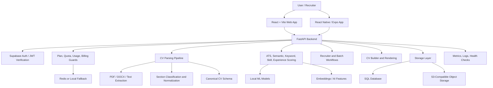
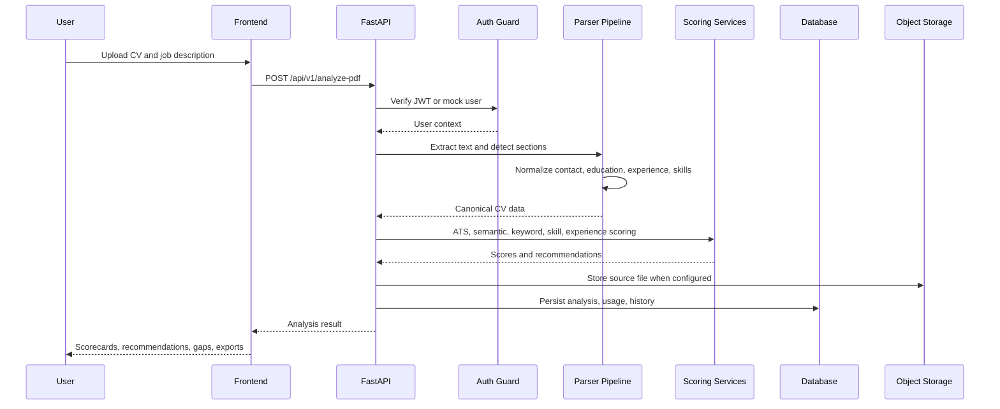
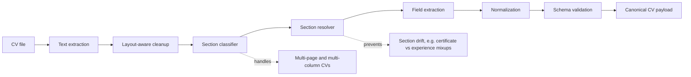
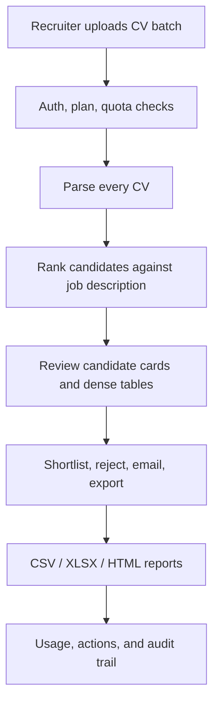
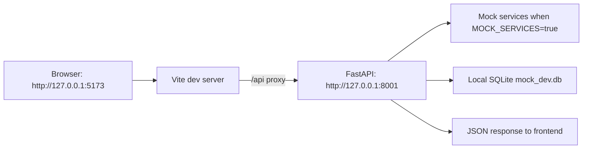
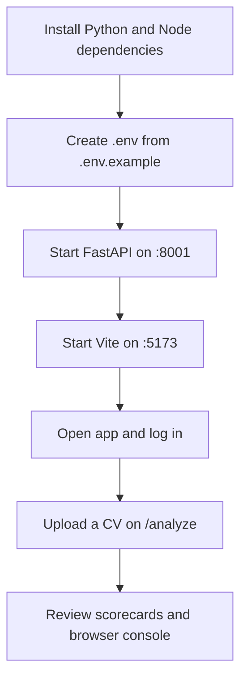
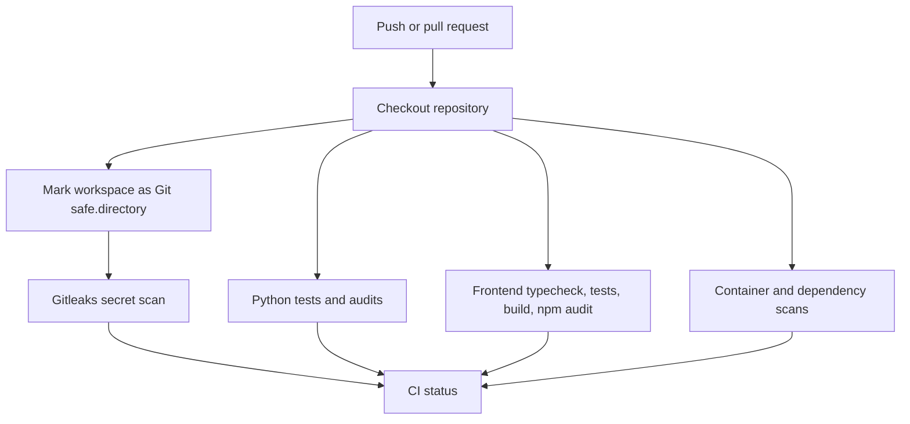
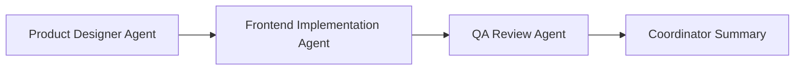

# CV Analyzer

CV Analyzer is an AI-assisted resume intelligence platform for candidate screening, ATS scoring, job-description matching, CV improvement, recruiter workflows, and product-grade analytics. The application combines a React/Vite frontend, a FastAPI backend, a multi-stage CV parsing pipeline, local/mock development modes, and production-oriented security, billing, and storage integrations.

## Contents

- [What It Does](#what-it-does)
- [Product Surfaces](#product-surfaces)
- [System Architecture](#system-architecture)
- [Core Flows](#core-flows)
- [Technology Stack](#technology-stack)
- [Quick Start](#quick-start)
- [Environment Configuration](#environment-configuration)
- [Validation Commands](#validation-commands)
- [Main API Areas](#main-api-areas)
- [Project Structure](#project-structure)
- [Security And CI](#security-and-ci)
- [UI Workflow](#ui-workflow)

## What It Does

CV Analyzer helps individual users and recruiters turn unstructured resumes into actionable, comparable, and exportable hiring intelligence.

Key capabilities:

- Parse PDF, DOCX, TXT, and structured CV data into a normalized schema.
- Score resumes for ATS readiness, keyword match, semantic relevance, skills, experience, layout, and content quality.
- Compare CVs against job descriptions and surface actionable gaps.
- Provide recruiter ranking, batch processing, candidate actions, reports, and email templates.
- Generate and preview CV Builder output in HTML, PDF, DOCX, and related formats.
- Support SaaS concerns such as authentication, plans, quotas, billing hooks, usage history, favorites, templates, sharing, and audits.
- Run locally in mock mode without requiring every production integration.

## Product Surfaces

| Surface | Purpose |
| --- | --- |
| Landing and auth | Public entry, login, registration, password recovery |
| Dashboard | Usage, streaks, history, insights, favorites, account status |
| Analyze | Single CV upload, parsing, scoring, job-description matching |
| Recruiter | Candidate/job workflows, batch ranking, reports, templates |
| Settings and profile | Account preferences, profile data, privacy/export controls |
| Ops and data center | Operational/admin surfaces where enabled |
| Mobile app | React Native/Expo client scaffold for core flows |

## System Architecture



The backend is intentionally split into route modules and shared runtime modules so the application can grow without keeping every API and lifecycle concern inside `main.py`.

## Core Flows

### CV Analysis Flow



### Parser Pipeline



### Recruiter Batch Flow



### Local Development Request Flow



If the frontend is running but the backend is not running on port `8001`, API calls under `/api/v1/*` will fail in the browser console. Start the backend first, then refresh the app.

## Technology Stack

| Layer | Tools |
| --- | --- |
| Web frontend | React 18, Vite, Vitest, CSS design tokens |
| Mobile | React Native, Expo, TypeScript |
| Backend | Python 3.12, FastAPI, SQLAlchemy, Alembic |
| Parsing and scoring | Custom parser services, section classifier, ML models, ATS scoring |
| Data | SQLite for mock/local, PostgreSQL-compatible production database |
| Auth | Supabase JWT verification |
| Storage | Local storage fallback, S3-compatible object storage |
| Ops | Docker, health checks, metrics, Gitleaks, dependency audits |

## Quick Start

### Prerequisites

- Python 3.12+
- Node.js 20+ or the bundled project Node runtime under `tools/`
- Git
- Optional: Docker and Docker Compose
- Optional production integrations: Supabase, Redis, S3, Stripe, OpenAI

### Backend

```bash
python -m venv .venv
.\.venv\Scripts\activate
python -m pip install --upgrade pip
python -m pip install -r requirements.txt
python -m uvicorn main:app --host 127.0.0.1 --port 8001
```

Health check:

```bash
curl http://127.0.0.1:8001/health
```

### Frontend

```bash
cd frontend
npm install
npm run dev
```

Open:

```text
http://127.0.0.1:5173/
```

### One-Screen Local Flow



## Environment Configuration

Start from the sample file:

```bash
copy .env.example .env
```

Important development variables:

```env
ENV=development
MOCK_SERVICES=true
MOCK_DATABASE_URL=sqlite:///./mock_dev.db
PORT=8001
```

Production-style deployments should configure real values for:

- `DATABASE_URL`
- `SUPABASE_URL`
- `SUPABASE_JWT_SECRET`
- `OPENAI_API_KEY`
- `REDIS_URL`
- `S3_BUCKET_NAME`
- `AWS_ACCESS_KEY_ID`
- `AWS_SECRET_ACCESS_KEY`
- `STRIPE_SECRET_KEY`

Never commit real secrets. The repository includes Gitleaks scanning in CI.

## Validation Commands

### Frontend

```bash
cd frontend
npx tsc --noEmit
npm test
npm run build
```

### Backend

```bash
python -m pytest --collect-only -q
python -m pytest tests/test_section_classifier.py tests/test_section_resolver.py tests/test_tasks.py -q --tb=short
```

### API Smoke Test

```bash
curl http://127.0.0.1:8001/health
curl http://127.0.0.1:5173/api/v1/usage
```

## Main API Areas

| Area | Example endpoints |
| --- | --- |
| Analysis | `POST /api/v1/analyze-pdf`, `GET /api/v1/usage-history` |
| Dashboard | `GET /api/v1/usage`, `GET /api/v1/insights`, `GET /api/v1/favorites` |
| CV Builder | `GET /api/v1/cv-builder/templates`, `POST /api/v1/cv-builder/preview-html` |
| Recruiter | Recruiter job, batch, candidate, template, export, and report routes |
| Billing and plans | Plan, entitlement, quota, and usage guard routes |
| User data | Profile, export, deletion, notes, templates, saved data |
| System | Health, readiness, metrics, operational checks |

API documentation is available when the backend is running:

```text
http://127.0.0.1:8001/docs
```

## Project Structure

```text
cv-analyzer/
  agents/                 Parser and extraction agent code
  core/                   App lifecycle, metrics, runtime, quota, shared dependencies
  frontend/               React/Vite web application
  mobile/                 React Native/Expo app scaffold
  routes/                 FastAPI route modules
  services/               Parsing, scoring, storage, billing, email, user services
  security/               Storage and request security helpers
  tests/                  Pytest coverage for parser, tasks, routes, services
  .codex/skills/          Product design, frontend, and UI QA workflows
  .github/workflows/      CI, security, dependency scanning
```

## Security And CI



Security notes:

- `.env` files, databases, model artifacts, local scratch data, sample CV files, and large archives are ignored.
- Gitleaks uses `.gitleaks.toml` and redacts findings in CI logs.
- The security workflow marks the GitHub workspace as a safe Git directory before running the Docker-based Gitleaks scan.
- S3 and storage helpers include guardrails for bucket access, path safety, and local fallback behavior.

## UI Workflow

The repository includes a Codex-oriented multi-agent UI workflow:



Files:

- `AGENTS.md`
- `.codex/skills/design-review/SKILL.md`
- `.codex/skills/frontend-implementation/SKILL.md`
- `.codex/skills/frontend-ui-polish/SKILL.md`
- `.codex/skills/ui-qa-review/SKILL.md`

The workflow is intentionally conservative:

- Do not redesign the whole product at once.
- Prefer shared design tokens and reusable styles.
- Preserve backend, auth, API, routing, and business logic.
- Run typecheck, tests, and build after UI changes.
- Use browser QA where possible for desktop and mobile viewports.

## Development Notes

- Frontend dev server: `http://127.0.0.1:5173`
- Backend dev server: `http://127.0.0.1:8001`
- Vite proxies `/api/*` to the backend.
- Mock mode is useful for UI and parser development without full production services.
- If API calls show `500` in the browser, first confirm the backend is running and healthy.

## License

This project is licensed under the MIT License.
