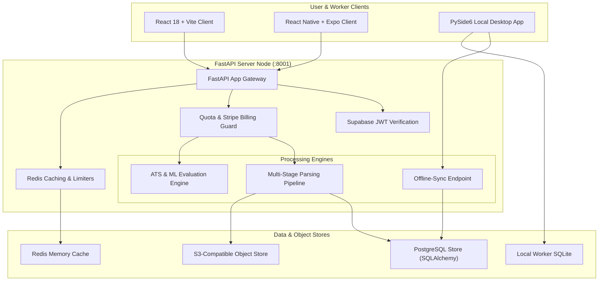
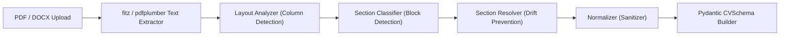
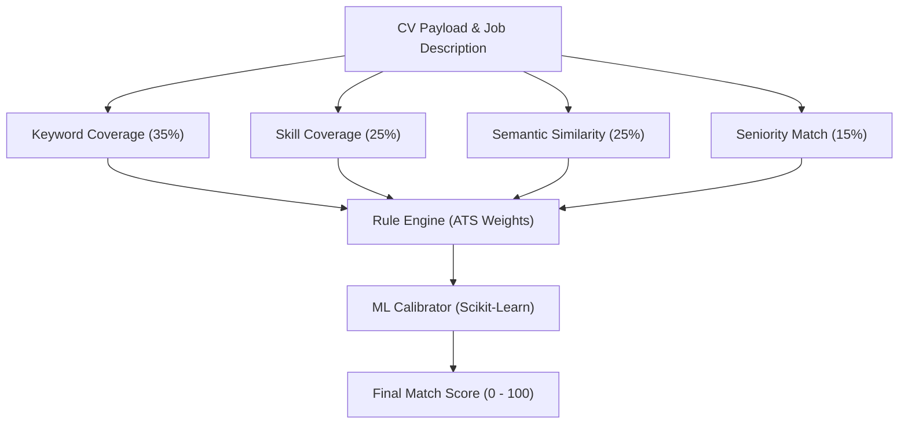
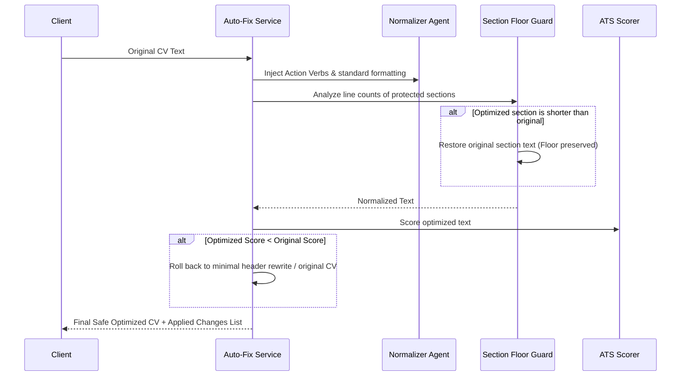
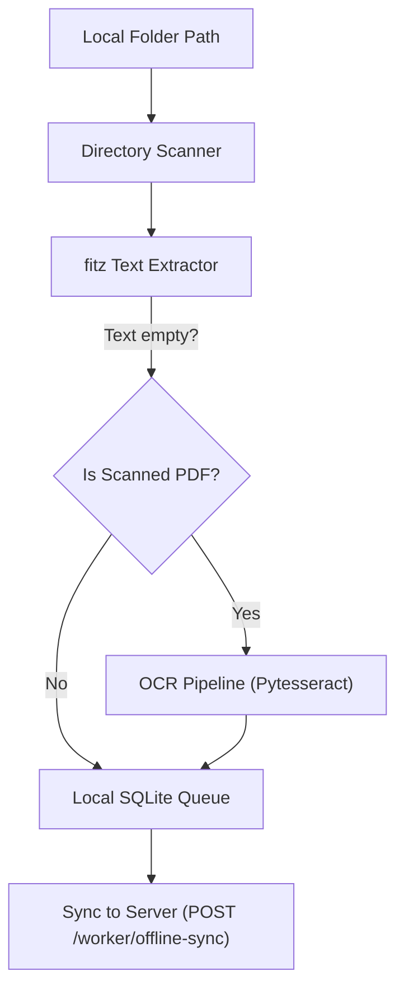

# CV Analyzer: Enterprise-Grade Resume Intelligence, ATS Calibration & Local Desktop Processing Grid

Welcome to the official technical documentation for **CV Analyzer**, a production-grade, high-throughput enterprise SaaS platform and local processing grid designed to turn unstructured resume formats (PDF, DOCX, TXT) into structured hiring intelligence.

Spanning nearly **160,000 lines of code**, this repository integrates a modular **FastAPI** microservice backend, an interactive **React 18 + Vite** web client, a **React Native + Expo** mobile app scaffold, and a **PySide6 Local Desktop Client** with OCR fallback capabilities and offline-first queue synchronization.

---

## Technical Overview & Architecture

CV Analyzer is designed around a distributed, local-first architecture. It accommodates two primary modes of operation:
1.  **SaaS Mode (Cloud-Native):** Handles requests through FastAPI, verifies tenant roles via Supabase JWTs, controls resource access with a Redis-backed rate-limiter, routes files to AWS S3, and billing through Stripe.
2.  **Local Worker Mode (Hybrid Edge):** A desktop GUI app (written in PySide6) processes directories of resumes locally, extracts text (falling back to OCR via Pytesseract if files are scanned PDFs), stores records in a local SQLite file, and synchronizes results with the cloud server's sync endpoints.



---

## 1. Deep Dive: Parsing & Linearization (Layout-Aware NLP)

PDF parsing often struggles with multi-column resume layouts, reading horizontally across columns and mixing up unrelated texts. CV Analyzer resolves this using a layout-aware multi-stage parsing pipeline:



### Layout-Aware Column Re-ordering
1.  **Geometric Analysis:** The layout analyzer segments the document into bounding boxes, identifying multi-column boundaries.
2.  **Linearization:** Text is re-ordered and linearized sequentially down each column before crossing boundaries. A special `multi_col_fixed` header is appended to notify downstream classifiers.
3.  **Language Detection:** The `language_service` inspects text features to detect English vs. Turkish dynamically, configuring matching dictionaries.
4.  **Section Classification:** Uses structural keywords to divide the text into sections: `summary`, `experience`, `education`, `projects`, `skills`, `certifications`, `languages`, `interests`, `misc`, `contact`.
5.  **Section Resolver:** Re-evaluates classifications using cross-section scoring weights (e.g. moves degree matches from experience to education, routes misplaced contact info to headers).

---

## 2. The Hybrid ATS Scoring & Calibration Model

CV Analyzer matches candidates against job descriptions using a hybrid score calculation model. It blends a deterministic, multi-factor rule engine (70% weight) with an ML match predictor model (30% weight):

$$\text{Overall Match Score} = \text{Rule-based Score} \times 0.70 + \text{ML Predictor Score} \times 0.30 $$



### Scoring Components
*   **Keyword Match (35%):** Scans the CV for overlapping terms from the job description (using NLTK tokenizers and Turkish/English lemma helpers).
*   **Skill Coverage (25%):** Categorizes and matches technical/soft skills against requirements.
*   **Semantic Similarity (25%):** Extracts embeddings via OpenAI API (or mock vectors locally) and calculates the cosine similarity.
*   **Seniority Matching (15%):** Extracts seniority levels (intern, junior, mid, senior, lead/manager) from both documents and scores the discrepancy.
*   **Outage Fallback & Capping:** 
    *   If no Job Description is provided, the overall match score defaults directly to the structural **ATS Quality Score** (evaluating layout, formatting, section presence, and lengths).
    *   If the embedding service is offline but a Job Description is present, the semantic score falls back to 0.0, and the overall score is capped at **40** to prevent inflation.

---

## 3. Auto-Fix & Section Floor Optimization Engine

The "Auto-Fix" tool restructures CV text to maximize ATS scoring compatibility, employing a safety-first feedback loop:



*   **Action Verb Injection:** Replaces passive verbs with strong action verbs (e.g., "Responsible for writing backend APIs" becomes "Developed and scaled backend APIs").
*   **Protected Floor Guard:** Sections classified as `skills`, `education`, `projects`, `certifications`, or `languages` are marked as protected. If the normalizer accidentally shrinks these sections, the engine restores the original lines.
*   **Regression Guard:** Automatically evaluates the generated text. If the score decreases compared to the original CV, it discards the text and falls back to preserving the source file.

---

## 4. PySide6 Desktop GUI & Local Folder Scanning

For recruiters processing files locally, the platform includes a local worker system in `local_worker/`:



*   **Offline Storage Queue:** Scans directories for PDF, DOCX, and TXT files. Progress, parsed text, and sync statuses (`pending`, `synced`, `failed`) are cached locally in a SQLite database (`local_worker.db`).
*   **OCR Fallback:** If `fitz` fails to extract text (indicating a scanned document), the system falls back to `pytesseract` to OCR the pages.
*   **Batch Synchronization:** Synchronizes results to the cloud server, checking tenant quotas before processing.

---

## 5. Database Schema Mapping

The database schema manages SaaS user states, recruiter operations, local worker logs, and usage details:

```text
  +-------------------+          +-------------------+
  |       User        |          |        Job        |
  +-------------------+          +-------------------+
  | id (PK)           |          | id (PK)           |
  | email             |          | user_id (FK)      |
  | plan_tier         |          | title             |
  | quota_limit       |          | description       |
  | quota_used        |          +---------+---------+
  +---------+---------+                    |
            |                              |
            +---------------+--------------+
                            |
                            v
                  +-------------------+
                  |     Analysis      |
                  +-------------------+
                  | id (PK)           |
                  | user_id (FK)      |
                  | job_id (FK)       |
                  | cv_text           |
                  | match_score       |
                  | ats_score         |
                  | created_at        |
                  +---------+---------+
                            |
            +---------------+---------------+
            |                               |
            v                               v
  +-------------------+           +-------------------+
  |     Candidate     |           |WorkerAnalysisRes  |
  +-------------------+           +-------------------+
  | id (PK)           |           | id (PK)           |
  | job_id (FK)       |           | candidate_id (FK) |
  | name              |           | worker_session    |
  | email             |           | cv_text           |
  | match_score       |           | sync_status       |
  +-------------------+           +-------------------+
```

---

## 6. Project Directory Mapping

The project structure keeps route handlers separated from parsing logic and normalizers:

```text
cv-analyzer/
├── agents/                       # Extraction and normalization agent logic
│   ├── extract_agent.py          # LLM/regex helper parsing raw text to JSON schemas
│   └── normalize_agent.py        # Cleans noise, dedupes lists, and structures schemas
├── core/                         # Core runtime, security, and logging config
│   ├── config.py                 # Environment variables and secrets setup
│   ├── database.py               # Engine connection pooling and sessions
│   ├── metrics.py                # Prometheus application metrics
│   ├── quota.py                  # Quota, plan tiers, and daily limits
│   └── security.py               # Request validation, CSRF, and CORS headers
├── routes/                       # FastAPI router handlers
│   ├── ai_tools.py               # Auto-fix, AI rewrites, and roadmaps
│   ├── analysis.py               # Uploads, parsing, evaluations, and history
│   ├── billing.py                # Plans, subscriptions, and Stripe webhooks
│   ├── dashboard.py              # Recruiter lists, shared pages, and analytics
│   ├── user_data.py              # User profiles, privacy exports, and notes
│   └── worker.py                 # Offline GUI worker sync endpoints
├── services/                     # Business services
│   ├── ats_scoring.py            # Hardcoded ATS guidelines and formatting checks
│   ├── ats_service.py            # Blends rules, embeddings, and ML calibrator
│   ├── cv_autofix_service.py     # Heading mapping, floor rules, action verbs
│   ├── embedding_service.py      # OpenAI embedding calls and fallback mock logic
│   ├── language_service.py       # Language classification (TR/EN)
│   ├── pdf_text_extractor.py     # PyMuPDF and pdfplumber extraction wrappers
│   ├── pipeline_runtime.py       # Core runner for parsing and scoring pipelines
│   ├── rewrite_service.py        # LLM integration for rewrites
│   ├── schema_builder.py         # Schema compliance, repairs, and fallbacks
│   └── storage_service.py        # File storage (Local disk vs AWS S3 buckets)
├── local_worker/                 # PySide6 desktop app and OCR engines
│   ├── qt_gui.py                 # PySide6 GUI interface for folder scanning
│   ├── worker.py                 # OCR fallback parser and SQLite tracker
│   └── workspace.py              # Worker environment setup
├── frontend/                     # React Single Page Application (SPA)
│   ├── src/pages/                # Main views (Landing, Dashboard, Analyze, Recruiter)
│   ├── src/components/           # Shared views (Navbar, Footer, Skeleton)
│   └── src/style.css             # Main styling, HSL colors, design tokens
├── mobile/                       # Expo mobile app scaffold
├── security/                     # Encryption, sanitization, XSS, and replay guards
└── tests/                        # 790+ unit, integration, and security checks
```

---

## 7. Main API Catalog

| Endpoint | Method | Purpose | Key Parameters |
| :--- | :--- | :--- | :--- |
| `/api/v1/analyze-pdf` | `POST` | Upload and evaluate a resume file against a JD | `file` (PDF/DOCX), `job_description` (text) |
| `/api/v1/cv-builder/auto-fix` | `POST` | Optimize resume formatting, inject action verbs | `cv_text` (text), `job_description` (text) |
| `/api/v1/usage` | `GET` | Retrieve account plan quota usage status | None (Supabase JWT Header) |
| `/api/v1/worker/offline-sync` | `POST` | Upload locally parsed worker records to the cloud | `candidate_data` (JSON list), `worker_id` |
| `/api/v1/billing/webhook` | `POST` | Stripe subscription state synchronization | Raw signature and request payload |

---

## 8. Installation & Quick Start

### Backend Service Setup
1.  Verify you have **Python 3.12+** installed.
2.  Set up your virtual environment and install packages:
    ```bash
    python -m venv .venv
    # Windows:
    .\.venv\Scripts\activate
    # macOS/Linux:
    source .venv/bin/activate

    python -m pip install --upgrade pip
    python -m pip install -r requirements.txt
    ```
3.  Configure the environment:
    ```bash
    cp .env.example .env
    ```
    Verify `MOCK_SERVICES=true` is enabled for local mock development without Supabase/OpenAI.
4.  Run the application server:
    ```bash
    python -m uvicorn main:app --host 127.0.0.1 --port 8001
    ```

### React Web Client Setup
1.  Navigate to the frontend directory:
    ```bash
    cd frontend
    ```
2.  Install packages and start the server:
    ```bash
    npm install
    npm run dev
    ```
3.  Open [http://127.0.0.1:5173/](http://127.0.0.1:5173/) to interact with the application.

### PySide6 Desktop GUI Setup
1.  Verify Tesseract OCR is installed on your system if you require scanned PDF scanning.
2.  Run the desktop app:
    ```bash
    python local_worker/qt_gui.py
    ```

---

## 9. Testing & Quality Assurance

All code updates must pass our unit tests, security audits, and typechecking rules:

### Python Backend Checks
Execute `pytest` to run our test suite, containing **over 790 tests**:
```bash
python -m pytest
```

### React Web Checks
Run typescript checks, unit tests, and production packaging:
```bash
# Inside frontend/ directory
npx.cmd tsc --noEmit
npm.cmd test
npm.cmd run build
```
