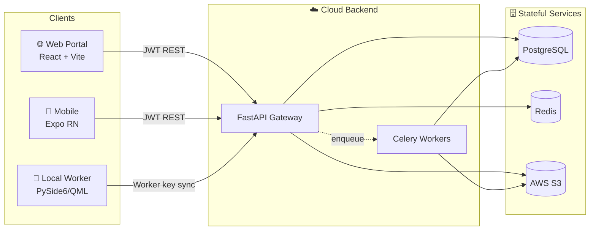
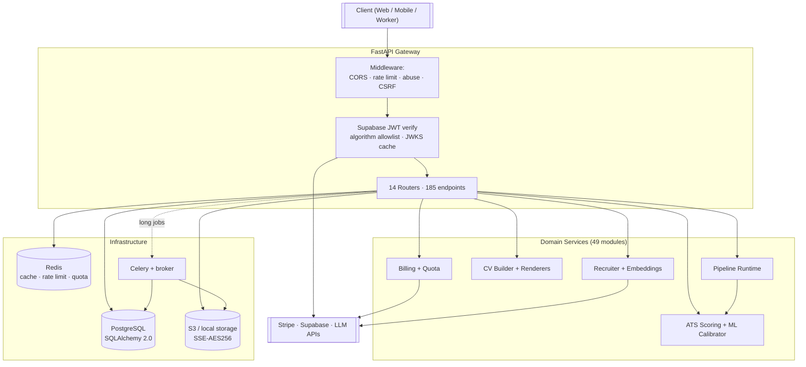
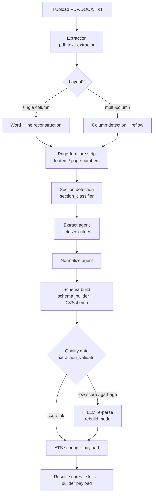
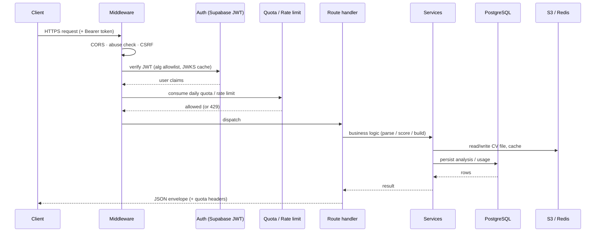
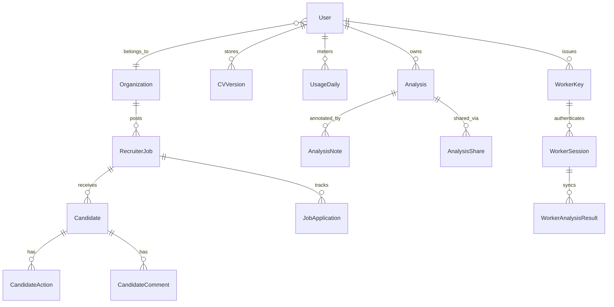
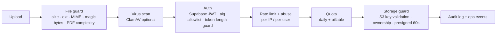
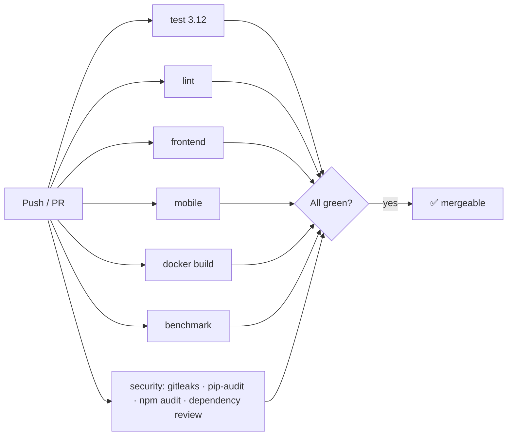
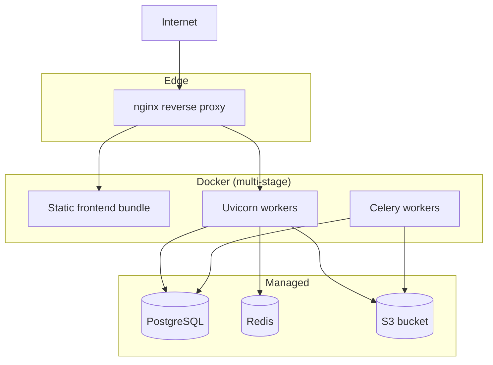

<div align="center">

# 🎯 CV Analyzer

### Enterprise-grade resume intelligence · ATS calibration · recruiter workflows · privacy-first local processing

*A hybrid SaaS + local-desktop platform that parses, scores, rewrites, and benchmarks résumés against applicant-tracking-system (ATS) criteria — with a deterministic-first parsing core and AI used only where it earns its cost.*


</div>

---

## 📑 Table of Contents

| # | Section | # | Section |
|---|---------|---|---------|
| 1 | [What is CV Analyzer](#-1-what-is-cv-analyzer) | 9 | [Data Model](#-9-data-model) |
| 2 | [Feature Matrix](#-2-feature-matrix) | 10 | [Security Model](#-10-security-model) |
| 3 | [System Architecture](#-3-system-architecture) | 11 | [Environment Variables](#-11-environment-variables) |
| 4 | [Technology Stack](#-4-technology-stack) | 12 | [Local Development](#-12-local-development) |
| 5 | [Repository Map](#-5-repository-map) | 13 | [Testing & Quality Gates](#-13-testing--quality-gates) |
| 6 | [The Parsing Pipeline](#-6-the-parsing-pipeline) | 14 | [Deployment](#-14-deployment) |
| 7 | [Request Lifecycle](#-7-request-lifecycle) | 15 | [Roadmap & Tech Debt](#-15-roadmap--technical-debt) |
| 8 | [API Surface](#-8-api-surface) | 16 | [Contributing](#-16-contributing) |

## License / Usage

This project is **source-available for portfolio and recruitment review only**. It is not open source.

Copyright (c) 2026 Sercan Ozkan. All rights reserved. No permission is granted to copy, modify, distribute, deploy, sublicense, host, sell, or commercially use this code without explicit written permission.

See [LICENSE](LICENSE) for the full terms.

---

## 🧭 1. What is CV Analyzer

CV Analyzer is composed of **four cooperating runtimes** that share one domain model:

| Runtime | Technology | Responsibility |
|---------|-----------|----------------|
| 🖥️ **Backend API** | FastAPI (ASGI) | REST gateway, parsing pipeline, ATS scoring, billing, auth, quotas, storage, worker sync |
| 🌐 **Web Portal** | React 18 + Vite | Landing, dashboards, analysis, CV Builder, recruiter workspace, billing UI |
| 📱 **Mobile Client** | Expo React Native | Upload + history scaffold for on-the-go use |
| 🔐 **Local Worker** | PySide6 / Qt Quick (QML) | Offline batch processing on the user's own machine; explicit sync only |

The product direction is **hybrid SaaS + local privacy**: the cloud handles accounts, billing, recruiter collaboration, and shared workflows, while the Local Worker keeps sensitive batch processing on the user's machine until a sync is explicitly requested.



---

## ✨ 2. Feature Matrix

### 👤 Candidate / Individual

| Feature | Description |
|---------|-------------|
| ATS analysis | Upload PDF/DOCX/TXT → overall + per-section ATS scores, detected/missing skills, recommendations |
| Score breakdown | Structure, keywords, experience, education, languages, ATS-friendliness, length |
| AI auto-fix | Deterministic résumé repair first; LLM rewrite only when parse quality is low or rebuild is requested |
| CV Builder | Template-based generation (DOCX / PDF / HTML / Typst) with plan-gated templates and fonts |
| Cover letters & interview prep | LLM-assisted cover-letter, interview-question, and answer-evaluation tools |
| History & sharing | Persisted analyses, notes, favorites, shareable tokens |

### 🧑‍💼 Recruiter / Hiring

| Feature | Description |
|---------|-------------|
| Jobs & batches | Create jobs, upload job descriptions, ingest candidate batches |
| Candidate ranking | Semantic + keyword match scoring, shortlist probability, strengths/concerns |
| Decisions & reports | Candidate actions, comments, reminders, exportable reports |
| Embeddings search | Index CVs, find similar candidates, semantic search |
| Local processing | Issue worker keys; process privately; sync selected results back |

### 🔐 Local Desktop

| Feature | Description |
|---------|-------------|
| Folder batch | Process local folders of PDF/DOCX/TXT resumes offline-first |
| Local exports | CSV / JSON / HTML outputs stored in a local workspace |
| Credential safety | API keys stored in local credential storage where available |
| Explicit sync | Results never leave the machine until the user syncs |

---

## 🏗️ 3. System Architecture



### Design patterns in play

| Pattern | Where |
|---------|-------|
| **Repository / Service layer** | `services/*` encapsulate data access + business logic behind route handlers |
| **Factory** | `ai_client_factory`, extraction handler selection by file type / layout |
| **Strategy** | Storage adapter (local vs S3), fix mode (preserve / light-fix / rebuild) |
| **Singleton** | DB session factory, Redis clients, loaded ML models, runtime settings |
| **Pipeline** | `extract → normalize → schema → validate → score` staged transform |
| **Circuit breaker / kill-switch** | `core/ops_runtime`, `shared._cb_*` guard external dependencies |

---

## 🧰 4. Technology Stack

### Backend

| Layer | Library | Version |
|-------|---------|---------|
| Web framework | FastAPI | `0.135.1` |
| ASGI server | Uvicorn | `0.42.0` |
| ORM | SQLAlchemy | `2.0.47` |
| Migrations | Alembic | `1.18.4` |
| Validation | Pydantic | `2.12.5` |
| Task queue | Celery | `5.6.2` |
| Cache / limits | redis-py | `7.2.1` |
| Object storage | boto3 (S3) | `1.42.73` |
| PDF extraction | pdfplumber / PyPDF2 | `0.11.9` / `3.0.1` |
| ML scoring | scikit-learn / XGBoost / NumPy | `1.8.0` / `3.2.0` / `2.4.2` |
| Auth (JWT) | python-jose | `3.5.0` |
| DB driver | psycopg2-binary | `2.9.11` |

### Frontend / Mobile / Desktop

| Layer | Library | Version |
|-------|---------|---------|
| UI library | React | `18.2` |
| Build tool | Vite | `8.0` |
| Styling | Tailwind CSS | `4.3` |
| Animation | Framer Motion | `12.36` |
| Routing | React Router DOM | `6.21` |
| Auth client | Supabase JS | — |
| Mobile | Expo / React Native | — |
| Desktop | PySide6 (Qt Quick / QML) | — |

---

## 🗂️ 5. Repository Map

```text
cv-analyzer/
├── main.py                 # FastAPI app bootstrap (routers, middleware, lifespan)
├── routes/                 # 14 routers, 185 endpoints
│   ├── analysis.py         #   ATS analyze (sync/async/pdf), ownership
│   ├── ai_tools.py         #   auto-fix, rewrite, cover letter, interview, embeddings
│   ├── cv_builder.py       #   templates, preview, generate, suggest-summary
│   ├── cv_storage.py       #   S3 upload/download/delete, score breakdown
│   ├── billing.py          #   Stripe checkout, webhooks, admin ops
│   ├── recruiter*.py       #   jobs, candidates, ranking, local sync
│   ├── dashboard.py        #   usage, plan, stats
│   ├── worker.py           #   local-worker claim/sync
│   └── system.py           #   health, readiness, ops
├── services/               # 49 domain services (see §6)
│   ├── pdf_text_extractor.py   # layout-aware PDF → text
│   ├── section_classifier.py   # language-agnostic section detection
│   ├── schema_builder.py       # normalized data → strict CVSchema
│   ├── extraction_validator.py # parse-quality gate → AI fallback
│   ├── cv_autofix_service.py   # deterministic repair + AI rewrite orchestration
│   ├── ats_scoring.py          # section + overall ATS scoring
│   └── ...
├── agents/                 # extract_agent, normalize_agent (pipeline stages)
├── core/                   # http_runtime, ops_runtime, quota, metrics, route_dependencies
├── models.py               # 30 SQLAlchemy models
├── schemas/                # Pydantic + CVSchema / CVModel
├── renderers/              # DOCX / PDF / HTML / Typst template engines
├── security/               # file_guard, s3_guard, rate_limit, runtime_guard
├── middleware/             # request middleware
├── alembic/ · migrations/  # DB migrations
├── frontend/               # React + Vite web portal
├── mobile/                 # Expo React Native scaffold
├── local_worker/           # PySide6 desktop app
├── tests/                  # 800+ backend tests, golden fixtures
└── .github/workflows/      # CI: test, lint, frontend, mobile, docker, security
```

---

## ⚙️ 6. The Parsing Pipeline

The parsing core is **deterministic-first**: rules and heuristics handle the bulk of CVs cheaply, and the LLM is invoked **only** when a confidence gate detects a low-quality parse. This keeps token spend proportional to difficulty.



### Pipeline stages & key services

| Stage | Service(s) | What it does |
|-------|-----------|--------------|
| **Extract** | `pdf_text_extractor` | Font-relative word tolerance (`x_tolerance_ratio`) so tightly-spaced PDFs don't glue words; multi-column detection & reflow; mojibake repair; **page-furniture stripping** (footers / `Page N` / template credits) |
| **Classify** | `section_classifier`, `section_resolver` | Language-agnostic section detection via aliases + structural signals; qualifier-aware headers (`Research Experience`, `Other Work Experience`) |
| **Extract fields** | `agents/extract_agent` | Splits contact, summary, experiences (one entry per job), education, skills, projects, certifications, languages |
| **Normalize** | `agents/normalize_agent` | Canonicalizes dates, bullets, casing, ordering |
| **Schema** | `schema_builder` | Maps normalized data into a strict `CVSchema`; bullet-glyph normalization (`●○◦…`); routes spoken languages to the languages field; drops substance-less entries |
| **Validate** | `extraction_validator` | **Quality gate** — detects garbage parses (fragment titles, over-split tables, lost sections, garbage skills) and flips `needs_llm_fallback` |
| **Score** | `ats_scoring`, `ml_calibrator`, `scoring_service` | Per-section + overall ATS scores; ML calibration with confidence |
| **Build** | `cv_builder_service`, `renderers/*` | Template rendering to DOCX / PDF / HTML / Typst |

### Robustness highlights (recent hardening)

| Problem | Fix |
|---------|-----|
| Glued words in tight PDFs (`BachelorofScience`) | Font-relative `x_tolerance_ratio` word splitting |
| `●`-bulleted jobs collapsing into one entry | Added `●○◦` + glyphs to all bullet regexes → correct per-job splitting |
| Page footers becoming fake jobs | Page-furniture stripping at extraction time |
| Spoken languages stuck in skills | Language-name / CEFR-gated routing into the languages field |
| Table & non-standard layouts shredding into garbage | **Fragmentation quality gate** routes them to LLM re-parse |

---

## 🔄 7. Request Lifecycle



---

## 🌐 8. API Surface

**185 endpoints across 14 routers**, all under `/api/v1`. Representative sample:

| Router | Sample endpoints | Purpose |
|--------|------------------|---------|
| `analysis` | `POST /analyze`, `/analyze-async`, `/analyze-pdf`, `GET /analysis/{id}` | ATS analysis (sync, async, file) |
| `cv_storage` | `POST /cv/upload`, `GET /cv/download`, `POST /score/breakdown` | S3 CV storage + full score breakdown |
| `cv_builder` | `/cv-builder/templates`, `/preview`, `/generate`, `/suggest-summary` | Template-based CV generation |
| `ai_tools` | `/cv/auto-fix`, `/rewrite-*`, `/cover-letter`, `/interview-*`, `/semantic-search` | AI-assisted tools + embeddings |
| `billing` | `/billing/*`, `/admin/ops/{health,cost,security}` | Stripe billing + admin operations |
| `recruiter` | `/recruiter/*` jobs, candidates, ranking, reports | Recruiter workspace |
| `worker` | claim / sync endpoints | Local Worker integration |
| `system` | `/health`, readiness, ops | Liveness / readiness probes |

> Responses use a consistent envelope (status, data, error, optional pagination meta) and carry quota headers.

---

## 🗃️ 9. Data Model

30 SQLAlchemy models. Core relationships:



| Domain | Models |
|--------|--------|
| Accounts & billing | `User`, `Organization`, `APISubscription`, `RolePermission`, `QuotaEvent`, `UsageDaily` |
| Analysis | `Analysis`, `CVVersion`, `AnalysisNote`, `AnalysisShare`, `Favorite` |
| Recruiter | `RecruiterJob`, `Candidate`, `Job`, `JobApplication`, `CandidateAction`, `CandidateComment`, `Reminder`, `JobTemplate`, `EmailTemplate` |
| Benchmarks | `ATSBenchmarkGlobal`, `ATSBenchmarkProfession`, `ATSBenchmarkScore` |
| Local worker | `WorkerKey`, `WorkerSession`, `WorkerClaim`, `WorkerAnalysisResult` |
| Ops | `AuditLog`, `FailedTask`, `AsyncTaskOwner` |

---

## 🛡️ 10. Security Model



| Layer | Control |
|-------|---------|
| Input | File size/extension/MIME/magic-byte validation, PDF complexity limits, optional ClamAV |
| Auth | Supabase JWT with algorithm allowlist, JWKS caching, token-length guard |
| Abuse | Per-IP & per-user rate limits, abuse bans, duplicate-request dedup |
| Quota | Daily + monthly plan limits, billable usage metering, cost guards |
| Storage | S3 SSE-AES256, key-format validation, ownership enforcement, 60s presigned URLs |
| Secrets | Env-var / secret-manager only; **Gitleaks** secret scan in CI |
| Supply chain | `pip-audit` + `npm audit` (root/frontend/mobile) + Dependency Review in CI |
| Billing | Stripe webhook HMAC signature verification |

---

## 🔑 11. Environment Variables

> Configure via `.env` (never commit secrets). Required values are validated at startup.

| Variable | Purpose |
|----------|---------|
| `DATABASE_URL` | PostgreSQL connection (SQLite for dev) |
| `REDIS_URL` | Cache, rate limiting, quota counters |
| `SUPABASE_URL`, `SUPABASE_JWT_*` | JWT verification / JWKS |
| `STRIPE_API_KEY`, `STRIPE_WEBHOOK_SECRET` | Billing + webhook verification |
| `AWS_*`, `S3_BUCKET`, `STORAGE_BACKEND` | Object storage (`s3` or `local`) |
| `RATE_LIMIT_IP_*`, `RATE_LIMIT_USER_*` | Per-IP / per-user request ceilings |
| `USER_PLAN_LIMITS_*`, `COST_*` | Daily quota + cost guards |
| `CLAMAV_ENABLED`, `ABUSE_PROTECTION_ENABLED`, `CSRF_PROTECTION_ENABLED` | Security toggles |
| `ENV`, `BUILD_ID`, `GIT_SHA`, `INSTANCE_ID` | Runtime metadata |

---

## 💻 12. Local Development

### Backend

```bash
python -m venv venv && source venv/bin/activate   # Windows: venv\Scripts\activate
pip install -r requirements.txt
alembic upgrade head
uvicorn main:app --reload --port 8000
```

### Frontend

```bash
cd frontend
npm install
npm run dev        # Vite dev server
npm run build      # production bundle
```

### Background workers (optional)

```bash
celery -A services.tasks worker --loglevel=info
```

### Local Worker (desktop)

```bash
cd local_worker
pip install -r requirements.txt
python main.py     # PySide6 / Qt Quick app
```

---

## 🧪 13. Testing & Quality Gates

| Suite | Command | Coverage |
|-------|---------|----------|
| Backend | `pytest tests/ -q` | 800+ tests: parsing, scoring, schema, security, tenancy, billing |
| Golden CVs | `pytest tests/golden/` | Regression fixtures for known résumé shapes |
| Frontend | `cd frontend && npm test -- --run` | 100 component/page tests (Vitest + Testing Library) |
| Lint | `ruff check . --select E9,F63,F7,F82` | Syntax / undefined-name gate |
| Format | `ruff format --check .` | Code style |

### CI (GitHub Actions)



12 checks gate every PR: `test (3.12)`, `lint`, `frontend`, `mobile`, `docker`, `benchmark`, `local-worker`, `security`, `Secret scan`, `Dependency review`, `Python dependency audit`, `Node dependency audit`.

---

## 🚀 14. Deployment



- **Multi-stage Docker** build produces a slim runtime image; the frontend is built and served as static assets behind **nginx**.
- Database migrations run via **Alembic** (`alembic upgrade head`) on release.
- Storage backend is swappable (`STORAGE_BACKEND=local|s3`) for dev vs production.

---

## 🗺️ 15. Roadmap & Technical Debt

| Item | Status |
|------|--------|
| Multi-job experience splitting (sub-section headers) | ✅ Fixed (per-job entries) |
| Page-furniture / footer noise removal | ✅ Fixed |
| Parse-quality → AI fallback gate | ✅ Added (routes shredded layouts to LLM) |
| Table-layout CV parsing | 🔶 Deterministic parser weak; covered via AI fallback |
| Embedded date splitting (`June 2024 to September 2024` → start/end) | 🔶 Planned |
| Non-experience sections (`Leadership Activities`) routed into experience | 🔶 Planned |
| `core/route_dependencies` legacy mutable-state migration | 🔶 In progress |
| `datetime.utcnow()` → timezone-aware migration | 🔶 Backlog |

---

## 🤝 16. Contributing

1. **Branch** off `main` (`feat/...`, `fix/...`, `refactor/...`).
2. **TDD** — write/adjust tests first; keep ≥80% coverage on touched code.
3. **Lint & format** — `ruff check` + `ruff format` must pass.
4. **Scoped commits** — conventional-commit style (`feat:`, `fix:`, `refactor:`…); stage only related files.
5. **PR** — ensure all 12 CI checks are green before requesting review.

> Commit/PR conventions and the full development workflow are enforced in CI; see `.github/workflows/`.

---

<div align="center">

**CV Analyzer** — deterministic where it can be, AI where it must be.

</div>
