<div align="center">

# 🎯 CV Analyzer

### ATS kalibrasyonu · özgeçmiş zekâsı · işe alım akışları · gizlilik öncelikli yerel işleme
### ATS calibration · resume intelligence · recruiter workflows · privacy-first local processing

*Deterministik bir ayrıştırma çekirdeği üzerine kurulu, yapay zekâyı yalnızca maliyetini hak ettiği yerde kullanan hibrit SaaS + yerel masaüstü platformu.*

*A hybrid SaaS + local-desktop platform built on a deterministic parsing core, using AI only where it earns its cost.*


**🇹🇷 Türkçe** &nbsp;·&nbsp; **🇬🇧 English** &nbsp;—&nbsp; *aşağıdaki sekmelerden dil seçin / pick a language tab below*

</div>

---

<details open>
<summary><h2>🇹🇷 &nbsp;Türkçe Dokümantasyon &nbsp;<sub>(açık — kapatmak için tıkla)</sub></h2></summary>

## 📑 İçindekiler

| # | Bölüm | # | Bölüm |
|---|-------|---|-------|
| 1 | [CV Analyzer nedir](#-1-cv-analyzer-nedir) | 10 | [Veri modeli](#-10-veri-modeli) |
| 2 | [Özellik matrisi](#-2-özellik-matrisi) | 11 | [Güvenlik modeli](#-11-güvenlik-modeli) |
| 3 | [Hızlı başlangıç](#-3-hızlı-başlangıç) | 12 | [Ortam değişkenleri](#-12-ortam-değişkenleri) |
| 4 | [Sistem mimarisi](#-4-sistem-mimarisi) | 13 | [Yerel geliştirme](#-13-yerel-geliştirme) |
| 5 | [Teknoloji yığını](#-5-teknoloji-yığını) | 14 | [Testler ve kalite kapıları](#-14-testler-ve-kalite-kapıları) |
| 6 | [Depo haritası](#-6-depo-haritası) | 15 | [CI/CD](#-15-cicd) |
| 7 | [Ayrıştırma hattı](#-7-ayrıştırma-hattı) | 16 | [Dağıtım](#-16-dağıtım) |
| 8 | [Bir isteğin yaşam döngüsü](#-8-bir-isteğin-yaşam-döngüsü) | 17 | [Yol haritası ve teknik borç](#-17-yol-haritası-ve-teknik-borç) |
| 9 | [API yüzeyi](#-9-api-yüzeyi) | 18 | [Katkı ve lisans](#-18-katkı-ve-lisans) |

---

## 🧭 1. CV Analyzer nedir

CV Analyzer, özgeçmişleri **ayrıştıran, puanlayan, yeniden yazan ve ATS (aday takip sistemi) ölçütlerine göre kıyaslayan** bir platformdur.

Temel tasarım kararı şudur: **önce deterministik, gerekirse yapay zekâ.** Kurallar ve sezgisel yöntemler özgeçmişlerin büyük çoğunluğunu ucuza çözer; dil modeli yalnızca bir kalite kapısı düşük nitelikli bir ayrıştırma tespit ettiğinde devreye girer. Böylece token harcaması zorlukla orantılı kalır.

Sistem, tek bir alan modelini paylaşan **dört çalışma zamanından** oluşur:

| Çalışma zamanı | Teknoloji | Sorumluluk |
|----------------|-----------|------------|
| 🖥️ **Backend API** | FastAPI (ASGI) | REST ağ geçidi, ayrıştırma hattı, ATS puanlama, faturalama, kimlik doğrulama, kota, depolama, worker senkronu |
| 🌐 **Web portalı** | React 18 + Vite | Açılış sayfası, panolar, analiz, CV Builder, işe alım çalışma alanı, faturalama arayüzü |
| 📱 **Mobil istemci** | Expo React Native | Yolda kullanım için yükleme + geçmiş iskeleti |
| 🔐 **Yerel Worker** | PySide6 / Qt Quick (QML) | Kullanıcının kendi makinesinde çevrimdışı toplu işleme; yalnızca açık talep üzerine senkron |

Ürün yönü **hibrit SaaS + yerel gizlilik**: bulut tarafı hesapları, faturalamayı, işe alım ekibi iş birliğini ve paylaşılan akışları yürütür; Yerel Worker ise hassas toplu işlemeyi kullanıcı açıkça senkron isteyene kadar makinede tutar.

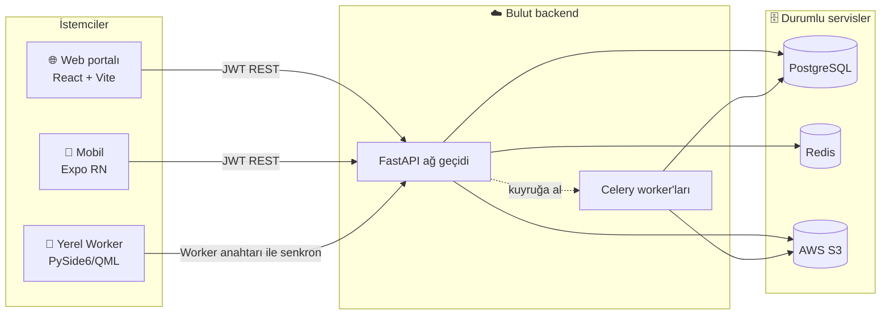
```mermaid
flowchart LR
    subgraph Istemciler["İstemciler"]
        W[🌐 Web portalı<br/>React + Vite]
        M[📱 Mobil<br/>Expo RN]
        L[🔐 Yerel Worker<br/>PySide6/QML]
    end
    subgraph Bulut["☁️ Bulut backend"]
        API[FastAPI ağ geçidi]
        WK[Celery worker'ları]
    end
    subgraph Veri["🗄️ Durumlu servisler"]
        DB[(PostgreSQL)]
        RD[(Redis)]
        S3[(AWS S3)]
    end
    W -->|JWT REST| API
    M -->|JWT REST| API
    L -->|Worker anahtarı ile senkron| API
    API --> DB
    API --> RD
    API --> S3
    API -.kuyruğa al.-> WK
    WK --> DB
    WK --> S3
```

---

## ✨ 2. Özellik matrisi

### 👤 Aday / bireysel kullanıcı

| Özellik | Açıklama |
|---------|----------|
| ATS analizi | PDF/DOCX/TXT yükle → genel ve bölüm bazlı ATS puanları, tespit edilen/eksik yetkinlikler, öneriler |
| Puan kırılımı | Yapı, anahtar kelimeler, deneyim, eğitim, diller, ATS uyumluluğu, uzunluk |
| Yapay zekâ ile onarım | Önce deterministik onarım; dil modeliyle yeniden yazım yalnızca ayrıştırma kalitesi düşükse veya yeniden inşa istenirse |
| CV Builder | Şablon tabanlı üretim (DOCX / PDF / HTML / Typst), plana göre kilitlenen şablon ve yazı tipleri |
| Ön yazı ve mülakat hazırlığı | Dil modeli destekli ön yazı, mülakat sorusu ve cevap değerlendirme araçları |
| Geçmiş ve paylaşım | Kalıcı analizler, notlar, favoriler, paylaşılabilir bağlantı belirteçleri |

### 🧑‍💼 İşe alım uzmanı

| Özellik | Açıklama |
|---------|----------|
| İlanlar ve partiler | İlan oluştur, iş tanımı yükle, toplu aday alımı |
| Aday sıralama | Anlamsal + anahtar kelime eşleşme puanı, kısa listeye kalma olasılığı, güçlü yönler ve endişeler |
| Kararlar ve raporlar | Aday aksiyonları, yorumlar, hatırlatıcılar, dışa aktarılabilir raporlar |
| Gömü (embedding) arama | CV indeksleme, benzer aday bulma, anlamsal arama |
| Yerel işleme | Worker anahtarı üret, gizli işle, seçilen sonuçları geri senkronla |

### 🔐 Yerel masaüstü

| Özellik | Açıklama |
|---------|----------|
| Klasör toplu işleme | Yerel PDF/DOCX/TXT klasörlerini çevrimdışı öncelikli işleme |
| Yerel dışa aktarım | Yerel çalışma alanında CSV / JSON / HTML çıktıları |
| Kimlik bilgisi güvenliği | API anahtarları, mümkün olan yerde işletim sisteminin kimlik deposunda |
| Açık senkron | Sonuçlar kullanıcı senkron isteyene kadar makineden çıkmaz |

---

## 🚀 3. Hızlı başlangıç

> **Ön koşullar:** Python 3.12, Node.js 20+, (isteğe bağlı) PostgreSQL 15+ ve Redis 7. Geliştirmede veritabanı olarak SQLite, depolama olarak yerel disk yeterlidir.

```bash
# 1) Depoyu klonla
git clone https://github.com/SercanOzkan55/CV-Analyzer.git
cd CV-Analyzer

# 2) Ortam dosyasını hazırla
cp .env.example .env          # Windows: copy .env.example .env

# 3) Backend
python -m venv venv
source venv/bin/activate      # Windows: venv\Scripts\activate
pip install -r requirements.txt
alembic upgrade head
uvicorn main:app --reload --port 8001

# 4) Frontend (ikinci bir terminalde)
cd frontend
cp .env.example .env          # Windows: copy .env.example .env
npm install
npm run dev
```

Backend `http://localhost:8001`, web portalı `http://localhost:3000` adresinde açılır.

> ⚠️ **Port 8001 zorunludur.** Frontend'in Vite proxy'si `/api` isteklerini `http://127.0.0.1:8001` adresine yönlendirir (`frontend/vite.config.mjs`), `Dockerfile` de 8001'i açar. Backend'i başka bir portta çalıştırırsanız arayüzden gelen tüm API çağrıları başarısız olur.

---

## 🏗️ 4. Sistem mimarisi

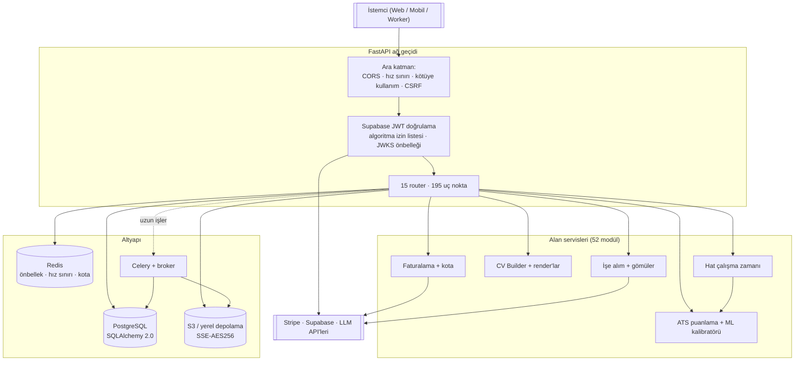
```mermaid
flowchart TD
    Client[["İstemci (Web / Mobil / Worker)"]]

    subgraph Gateway["FastAPI ağ geçidi"]
        MW[Ara katman:<br/>CORS · hız sınırı · kötüye kullanım · CSRF]
        AUTH[Supabase JWT doğrulama<br/>algoritma izin listesi · JWKS önbelleği]
        ROUTE[15 router · 195 uç nokta]
    end

    subgraph Domain["Alan servisleri (52 modül)"]
        PIPE[Hat çalışma zamanı]
        ATS[ATS puanlama + ML kalibratörü]
        BUILD[CV Builder + render'lar]
        REC[İşe alım + gömüler]
        BILL[Faturalama + kota]
    end

    subgraph Infra["Altyapı"]
        DB[(PostgreSQL<br/>SQLAlchemy 2.0)]
        RD[(Redis<br/>önbellek · hız sınırı · kota)]
        S3[(S3 / yerel depolama<br/>SSE-AES256)]
        CEL[Celery + broker]
    end

    EXT[[Stripe · Supabase · LLM API'leri]]

    Client --> MW --> AUTH --> ROUTE
    ROUTE --> PIPE & ATS & BUILD & REC & BILL
    PIPE --> ATS
    BILL --> EXT
    AUTH --> EXT
    ROUTE --> DB & RD & S3
    ROUTE -.uzun işler.-> CEL --> DB & S3
    REC --> EXT
```

### Kullanılan tasarım örüntüleri

| Örüntü | Nerede |
|--------|--------|
| **Repository / servis katmanı** | `services/*`, veri erişimi ve iş mantığını route işleyicilerinin arkasında kapsüller |
| **Factory** | `ai_client_factory`; dosya türü / yerleşime göre çıkarım işleyicisi seçimi |
| **Strategy** | Depolama adaptörü (yerel vs S3), onarım kipi (koru / hafif onar / yeniden inşa et) |
| **Singleton** | DB oturum fabrikası, Redis istemcileri, yüklenmiş ML modelleri, çalışma zamanı ayarları |
| **Pipeline** | `çıkar → normalize et → şema → doğrula → puanla` aşamalı dönüşüm |
| **Devre kesici / kill-switch** | `core/ops_runtime`, `shared._cb_*` dış bağımlılıkları korur |

---

## 🧰 5. Teknoloji yığını

### Backend

| Katman | Kütüphane | Sürüm |
|--------|-----------|-------|
| Web çatısı | FastAPI | `0.135.1` |
| ASGI sunucusu | Uvicorn | `0.42.0` |
| ORM | SQLAlchemy | `2.0.47` |
| Göçler | Alembic | `1.18.4` |
| Doğrulama | Pydantic | `2.12.5` |
| Görev kuyruğu | Celery | `5.6.2` |
| Önbellek / sınırlar | redis-py | `7.2.1` |
| Nesne depolama | boto3 (S3) | `1.42.73` |
| PDF çıkarımı | pdfplumber / pypdf / pypdfium2 | `0.11.9` / `6.16.2` / `5.6.0` |
| ML puanlama | scikit-learn / XGBoost / NumPy | `1.8.0` / `3.2.0` / `2.4.2` |
| JWT | PyJWT | `2.13.0` |
| DB sürücüsü | psycopg2-binary | `2.9.11` |

### Frontend / mobil / masaüstü

| Katman | Kütüphane | Sürüm |
|--------|-----------|-------|
| Arayüz kütüphanesi | React | `18.2` |
| Derleme aracı | Vite | `8.0` |
| Stil | Tailwind CSS | `4.3` |
| Animasyon | Framer Motion | `12.36` |
| Yönlendirme | React Router DOM | `6.21` |
| Kimlik istemcisi | Supabase JS | `2.39` |
| Test | Vitest + Testing Library | `4.1` |
| Mobil | Expo / React Native | — |
| Masaüstü | PySide6 (Qt Quick / QML) | — |

---

## 🗂️ 6. Depo haritası

```text
CV-Analyzer/
├── main.py                 # FastAPI uygulama önyüklemesi (router, ara katman, lifespan)
├── routes/                 # 15 router, 195 uç nokta
│   ├── analysis.py         #   ATS analizi (senkron/asenkron/pdf), sahiplik
│   ├── ai_tools.py         #   otomatik onarım, yeniden yazım, ön yazı, mülakat, gömüler
│   ├── cv_builder.py       #   şablonlar, önizleme, üretim, özet önerisi
│   ├── cv_storage.py       #   S3 yükleme/indirme/silme, puan kırılımı
│   ├── billing.py          #   Stripe ödeme, webhook'lar, yönetici işlemleri
│   ├── recruiter*.py       #   ilanlar, adaylar, sıralama, yerel senkron (3 dosya)
│   ├── dashboard.py        #   kullanım, plan, istatistikler
│   ├── user_data.py        #   kullanıcı verisi, dışa aktarım, silme
│   ├── owner_workflow.py   #   sahip/operatör akışları
│   ├── worker.py           #   yerel worker claim/senkron
│   ├── downloads.py        #   üretilmiş dosya indirmeleri
│   ├── blog.py             #   blog içeriği (bayrakla kapalı)
│   └── system.py           #   sağlık, hazırlık, ops
├── services/               # 52 alan servisi (bkz. §7)
│   ├── pdf_text_extractor.py   # yerleşim farkındalıklı PDF → metin
│   ├── section_classifier.py   # dilden bağımsız bölüm tespiti
│   ├── schema_builder.py       # normalize veri → katı CVSchema
│   ├── extraction_validator.py # ayrıştırma kalite kapısı → AI yedeği
│   ├── cv_autofix_service.py   # deterministik onarım + AI yeniden yazım orkestrasyonu
│   ├── ats_scoring.py          # bölüm ve genel ATS puanlaması
│   └── ...
├── agents/                 # extract_agent, normalize_agent (hat aşamaları)
├── core/                   # http_runtime, ops_runtime, quota, metrics, route_dependencies
├── models.py               # 35 SQLAlchemy modeli
├── schemas/                # Pydantic + CVSchema / CVModel
├── renderers/              # DOCX / PDF / HTML / Typst şablon motorları
├── security/               # file_guard, s3_guard, rate_limit, runtime_guard
├── middleware/             # istek ara katmanı
├── alembic/ · migrations/  # veritabanı göçleri
├── frontend/               # React + Vite web portalı
├── mobile/                 # Expo React Native iskeleti
├── local_worker/           # PySide6 masaüstü uygulaması
├── tests/                  # 125 test dosyası, 981 test, golden fixture'lar
└── .github/workflows/      # CI: ci.yml · security.yml · build-local-worker.yml
```

---

## ⚙️ 7. Ayrıştırma hattı

Ayrıştırma çekirdeği **önce deterministiktir**. Dil modeli yalnızca bir güven kapısı düşük kaliteli ayrıştırma tespit ettiğinde çağrılır.

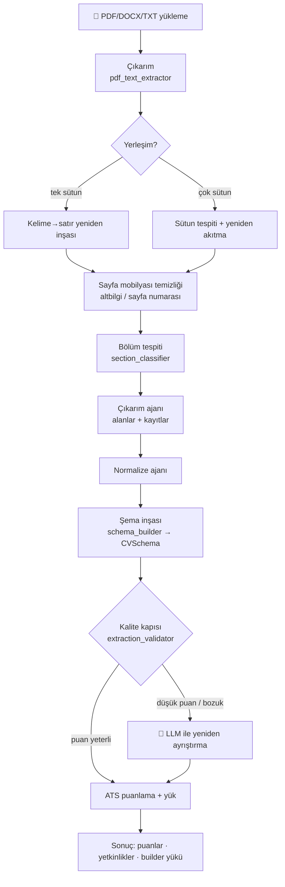
```mermaid
flowchart TD
    A[📄 PDF/DOCX/TXT yükleme] --> B[Çıkarım<br/>pdf_text_extractor]
    B --> B1{Yerleşim?}
    B1 -->|tek sütun| C[Kelime→satır yeniden inşası]
    B1 -->|çok sütun| C2[Sütun tespiti + yeniden akıtma]
    C --> D[Sayfa mobilyası temizliği<br/>altbilgi / sayfa numarası]
    C2 --> D
    D --> E[Bölüm tespiti<br/>section_classifier]
    E --> F[Çıkarım ajanı<br/>alanlar + kayıtlar]
    F --> G[Normalize ajanı]
    G --> H[Şema inşası<br/>schema_builder → CVSchema]
    H --> I{Kalite kapısı<br/>extraction_validator}
    I -->|puan yeterli| K[ATS puanlama + yük]
    I -->|düşük puan / bozuk| J[🤖 LLM ile yeniden ayrıştırma]
    J --> K
    K --> L[Sonuç: puanlar · yetkinlikler · builder yükü]
```

### Hat aşamaları ve anahtar servisler

| Aşama | Servis(ler) | Ne yapar |
|-------|-------------|----------|
| **Çıkarım** | `pdf_text_extractor` | Yazı tipine göreli kelime toleransı (`x_tolerance_ratio`) sayesinde sıkışık PDF'lerde kelimeler birbirine yapışmaz; çok sütun tespiti ve yeniden akıtma; mojibake onarımı; **sayfa mobilyası temizliği** (altbilgi / `Sayfa N` / şablon künyesi) |
| **Sınıflandırma** | `section_classifier`, `section_resolver` | Takma ad ve yapısal sinyallerle dilden bağımsız bölüm tespiti; niteleyici farkındalıklı başlıklar (`Araştırma Deneyimi`, `Diğer İş Deneyimi`) |
| **Alan çıkarımı** | `agents/extract_agent` | İletişim, özet, deneyimler (iş başına bir kayıt), eğitim, yetkinlikler, projeler, sertifikalar, diller |
| **Normalizasyon** | `agents/normalize_agent` | Tarihleri, madde imlerini, büyük/küçük harfi ve sıralamayı kanonikleştirir |
| **Şema** | `schema_builder` | Normalize veriyi katı bir `CVSchema`'ya eşler; madde imi glif normalizasyonu (`●○◦…`); konuşulan dilleri diller alanına yönlendirir; içeriksiz kayıtları eler |
| **Doğrulama** | `extraction_validator` | **Kalite kapısı** — bozuk ayrıştırmaları (parça başlıklar, aşırı bölünmüş tablolar, kaybolan bölümler, anlamsız yetkinlikler) tespit eder ve `needs_llm_fallback` bayrağını kaldırır |
| **Puanlama** | `ats_scoring`, `ml_calibrator`, `scoring_service` | Bölüm bazlı ve genel ATS puanları; güven değeriyle ML kalibrasyonu |
| **İnşa** | `cv_builder_service`, `renderers/*` | Şablonların DOCX / PDF / HTML / Typst olarak render'lanması |

### Dayanıklılık iyileştirmeleri

| Sorun | Çözüm |
|-------|-------|
| Sıkışık PDF'lerde yapışan kelimeler (`BachelorofScience`) | Yazı tipine göreli `x_tolerance_ratio` ile kelime ayırma |
| `●` imli işlerin tek kayda çökmesi | Tüm madde imi regex'lerine `●○◦` ve gliflerin eklenmesi → iş başına doğru bölme |
| Sayfa altbilgilerinin sahte iş kaydına dönüşmesi | Çıkarım anında sayfa mobilyası temizliği |
| Konuşulan dillerin yetkinliklerde sıkışması | Dil adı / CEFR kontrollü diller alanına yönlendirme |
| Tablo ve standart dışı yerleşimlerin parçalanması | **Parçalanma kalite kapısı** bunları LLM ile yeniden ayrıştırmaya yönlendirir |

---

## 🔄 8. Bir isteğin yaşam döngüsü

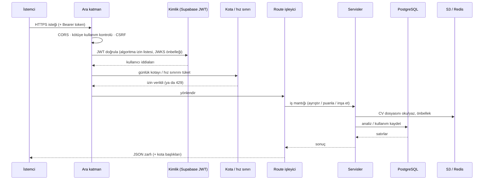
```mermaid
sequenceDiagram
    participant U as İstemci
    participant MW as Ara katman
    participant A as Kimlik (Supabase JWT)
    participant Q as Kota / hız sınırı
    participant R as Route işleyici
    participant S as Servisler
    participant DB as PostgreSQL
    participant X as S3 / Redis

    U->>MW: HTTPS isteği (+ Bearer token)
    MW->>MW: CORS · kötüye kullanım kontrolü · CSRF
    MW->>A: JWT doğrula (algoritma izin listesi, JWKS önbelleği)
    A-->>MW: kullanıcı iddiaları
    MW->>Q: günlük kotayı / hız sınırını tüket
    Q-->>MW: izin verildi (ya da 429)
    MW->>R: yönlendir
    R->>S: iş mantığı (ayrıştır / puanla / inşa et)
    S->>X: CV dosyasını oku/yaz, önbellek
    S->>DB: analiz / kullanım kaydet
    DB-->>S: satırlar
    S-->>R: sonuç
    R-->>U: JSON zarfı (+ kota başlıkları)
```

---

## 🌐 9. API yüzeyi

**15 router, 195 uç nokta**, tümü `/api/v1` altında.

| Router | Uç nokta | Amaç |
|--------|---------:|------|
| `recruiter` | 26 | İşe alım çalışma alanı: ilanlar, adaylar, sıralama, raporlar |
| `ai_tools` | 24 | Otomatik onarım, yeniden yazım, ön yazı, mülakat, anlamsal arama, gömüler |
| `dashboard` | 21 | Kullanım, plan, istatistikler |
| `worker` | 19 | Yerel Worker claim / senkron |
| `owner_workflow` | 18 | Sahip ve operatör akışları |
| `user_data` | 15 | Kullanıcı verisi, dışa aktarım, silme (KVKK/GDPR) |
| `system` | 15 | Sağlık, hazırlık, ops uç noktaları |
| `billing` | 14 | Stripe ödeme, webhook'lar, yönetici işlemleri |
| `analysis` | 13 | ATS analizi (senkron, asenkron, dosya) |
| `recruiter_local` | 9 | İşe alım tarafı yerel işleme köprüsü |
| `cv_builder` | 6 | Şablon tabanlı CV üretimi |
| `cv_storage` | 5 | S3 CV depolama + puan kırılımı |
| `blog` | 5 | Blog içeriği (`VITE_ENABLE_BLOG` ile kapalı) |
| `recruiter_extended` | 3 | Genişletilmiş işe alım işlemleri |
| `downloads` | 2 | Üretilmiş dosya indirmeleri |

> Yanıtlar tutarlı bir zarf kullanır (durum, veri, hata, isteğe bağlı sayfalama meta verisi) ve kota başlıkları taşır.

---

## 🗃️ 10. Veri modeli

35 SQLAlchemy modeli. Çekirdek ilişkiler:

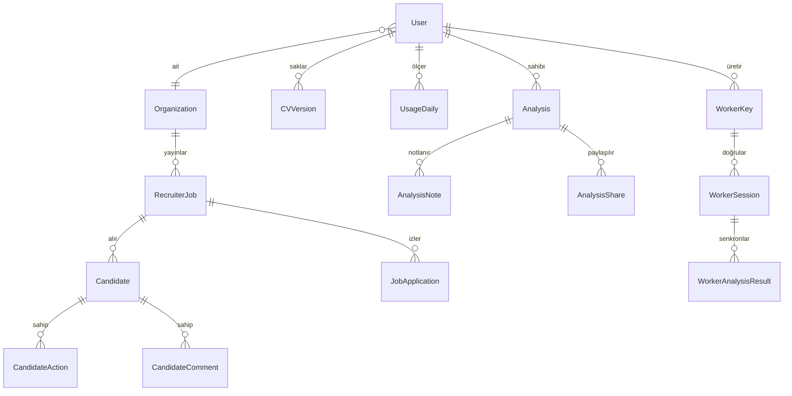
```mermaid
erDiagram
    User ||--o{ Analysis : sahibi
    User ||--o{ CVVersion : saklar
    User ||--o{ UsageDaily : ölçer
    User }o--|| Organization : ait
    Organization ||--o{ RecruiterJob : yayınlar
    RecruiterJob ||--o{ Candidate : alır
    RecruiterJob ||--o{ JobApplication : izler
    Candidate ||--o{ CandidateAction : sahip
    Candidate ||--o{ CandidateComment : sahip
    Analysis ||--o{ AnalysisNote : notlanır
    Analysis ||--o{ AnalysisShare : paylaşılır
    User ||--o{ WorkerKey : üretir
    WorkerKey ||--o{ WorkerSession : doğrular
    WorkerSession ||--o{ WorkerAnalysisResult : senkronlar
```

| Alan | Modeller |
|------|----------|
| Hesap ve faturalama | `User`, `Organization`, `APISubscription`, `RolePermission`, `QuotaEvent`, `UsageDaily` |
| Analiz | `Analysis`, `CVVersion`, `AnalysisNote`, `AnalysisShare`, `Favorite` |
| İşe alım | `RecruiterJob`, `Candidate`, `Job`, `JobApplication`, `CandidateAction`, `CandidateComment`, `Reminder`, `JobTemplate`, `EmailTemplate` |
| Kıyaslama | `ATSBenchmarkGlobal`, `ATSBenchmarkProfession`, `ATSBenchmarkScore` |
| Yerel worker | `WorkerKey`, `WorkerSession`, `WorkerClaim`, `WorkerAnalysisResult` |
| Operasyon | `AuditLog`, `FailedTask`, `AsyncTaskOwner` |

---

## 🛡️ 11. Güvenlik modeli

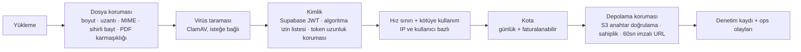
```mermaid
flowchart LR
    A[Yükleme] --> B[Dosya koruması<br/>boyut · uzantı · MIME · sihirli bayt · PDF karmaşıklığı]
    B --> C[Virüs taraması<br/>ClamAV, isteğe bağlı]
    C --> D[Kimlik<br/>Supabase JWT · algoritma izin listesi · token uzunluk koruması]
    D --> E[Hız sınırı + kötüye kullanım<br/>IP ve kullanıcı bazlı]
    E --> F[Kota<br/>günlük + faturalanabilir]
    F --> G[Depolama koruması<br/>S3 anahtar doğrulama · sahiplik · 60sn imzalı URL]
    G --> H[Denetim kaydı + ops olayları]
```

| Katman | Kontrol |
|--------|---------|
| Girdi | Dosya boyutu/uzantı/MIME/sihirli bayt doğrulaması, PDF karmaşıklık sınırları, isteğe bağlı ClamAV |
| Kimlik | Algoritma izin listeli Supabase JWT, JWKS önbelleği, token uzunluk koruması |
| Kötüye kullanım | IP ve kullanıcı bazlı hız sınırları, yasaklar, yinelenen istek tekilleştirmesi |
| Kota | Günlük ve aylık plan limitleri, faturalanabilir kullanım ölçümü, maliyet korumaları |
| Depolama | S3 SSE-AES256, anahtar biçimi doğrulaması, sahiplik zorlaması, 60 saniyelik imzalı URL'ler |
| Sırlar | Yalnızca ortam değişkeni / sır yöneticisi; CI'da **Gitleaks** sır taraması |
| Tedarik zinciri | CI'da `pip-audit` + `npm audit` (kök/frontend/mobil) + Dependency Review |
| Faturalama | Stripe webhook HMAC imza doğrulaması |

---

## 🔑 12. Ortam değişkenleri

`.env.example` dosyasında **176 değişken** tanımlıdır; tam liste ve varsayılanlar için o dosyaya bakın. Sırları asla depoya işlemeyin — zorunlu değerler uygulama açılışında doğrulanır.

### Backend (`.env`)

| Grup | Örnek değişkenler | Amaç |
|------|-------------------|------|
| Çekirdek | `PORT`, `ENV`, `APP_TIMEZONE`, `BUILD_ID`, `GIT_SHA` | Çalışma zamanı kimliği ve meta verisi |
| Veritabanı | `DATABASE_URL` | PostgreSQL bağlantısı (geliştirmede SQLite) |
| Önbellek | `REDIS_URL` | Önbellek, hız sınırlama, kota sayaçları |
| Kimlik | `SUPABASE_URL`, `SUPABASE_JWT_*` | JWT doğrulama / JWKS |
| Faturalama | `STRIPE_API_KEY`, `STRIPE_WEBHOOK_SECRET`, `BILLING_ADMIN_TOKEN` | Stripe ve webhook doğrulaması |
| Depolama | `STORAGE_BACKEND`, `AWS_*`, `S3_BUCKET`, `AWS_USE_IAM_ROLE` | Nesne depolama (`s3` veya `local`) |
| Hız sınırı | `RATE_LIMIT_IP_*`, `RATE_LIMIT_USER_*`, `ADMIN_RATE_LIMIT_PER_MIN` | İstek tavanları |
| Kötüye kullanım | `ABUSE_PROTECTION_ENABLED`, `ABUSE_BAN_SECONDS`, `ABUSE_SCORE_*` | Kötüye kullanım tespiti ve yasaklar |
| Kota / plan | `ENTITLE_FREE_DAILY_CV`, `ENTITLE_PRO_DAILY_CV`, `ENTITLE_ENTERPRISE_DAILY_CV`, `AUTO_NEW_USER_PLAN` | Plan hakları |
| Eşzamanlılık | `CONCURRENCY_ANALYZE`, `CONCURRENCY_EMBED`, `CONCURRENCY_REWRITE`, … | Aşama bazlı eşzamanlılık tavanları |
| Yapay zekâ | `AI_TIMEOUT_SECONDS`, `AI_MAX_RETRIES`, `ENABLE_AI_REVIEW`, `AI_FINAL_REVIEW_ATS_THRESHOLD` | LLM davranışı ve maliyet korumaları |
| ATS | `ATS_MODEL_PATH`, `ATS_CONFIG_PATH`, `ATS_WEIGHT`, `ENABLE_CLASSIFIER` | Puanlama modeli ve ağırlıkları |
| Veri saklama | `CV_RETENTION_DAYS`, `CV_RETENTION_BATCH_LIMIT`, `CV_VERSION_TEXT_STORAGE_MODE` | Saklama politikası |
| Güvenlik anahtarları | `CSRF_PROTECTION_ENABLED`, `CLAMAV_ENABLED`, `ADMIN_TOKEN`, `ADMIN_IP_ALLOWLIST` | Güvenlik anahtarları |
| Yedekleme | `BACKUP_DIR`, `BACKUP_RETENTION_DAYS`, `BACKUP_S3_PREFIX` | Yedekleme işleri |
| Devre kesici | `CB_FAILURE_THRESHOLD`, `CB_COOLDOWN_SECONDS` | Dış bağımlılık koruması |

### Frontend (`frontend/.env`)

| Değişken | Amaç |
|----------|------|
| `VITE_API_BASE` | Backend'in temel URL'i (üretim) |
| `VITE_SUPABASE_URL`, `VITE_SUPABASE_KEY` | Supabase istemci kimliği |
| `VITE_PRIVATE_MODE` | Siteyi giriş arkasına kilitler, kaydı kapatır |
| `VITE_REGISTRATION_DISABLED` | Kaydı bağımsız olarak kapatır |
| `VITE_ENABLE_BLOG` | Blog yalnızca localStorage demosudur — gerçek bir backend'i olana dek kapalı tutun |
| `VITE_ENABLE_BILLING` | Stripe üretime hazır olana dek ödeme ve faturalama portalı gizli kalır |

---

## 💻 13. Yerel geliştirme

### Backend

```bash
python -m venv venv && source venv/bin/activate   # Windows: venv\Scripts\activate
pip install -r requirements.txt
alembic upgrade head
uvicorn main:app --reload --port 8001
```

### Frontend

```bash
cd frontend
npm install
npm run dev          # Vite geliştirme sunucusu (port 3000)
npm run build        # üretim paketi + SEO ön render'ı
npm run preview      # üretim paketini yerelde servis et
```

### Arka plan worker'ları (isteğe bağlı)

```bash
celery -A services.tasks worker --loglevel=info
```

### Yerel Worker (masaüstü)

```bash
cd local_worker
pip install -r requirements.txt
python main.py       # PySide6 / Qt Quick uygulaması
```

---

## 🧪 14. Testler ve kalite kapıları

| Paket | Komut | Kapsam |
|-------|-------|--------|
| Backend | `pytest tests/ -q` | 125 dosyada **981 test**: ayrıştırma, puanlama, şema, güvenlik, kiracılık, faturalama |
| Golden CV'ler | `pytest tests/golden/` | Bilinen özgeçmiş biçimleri için regresyon fixture'ları |
| Frontend | `cd frontend && npm test` | 24 dosyada **129 test** (Vitest + Testing Library) |
| Frontend tip kontrolü | `cd frontend && npm run typecheck` | `tsc --noEmit` |
| Lint | `ruff check . --select E9,F63,F7,F82` | Sözdizimi / tanımsız ad kapısı |
| Biçim | `ruff format --check .` | Kod stili |

---

## 🔁 15. CI/CD

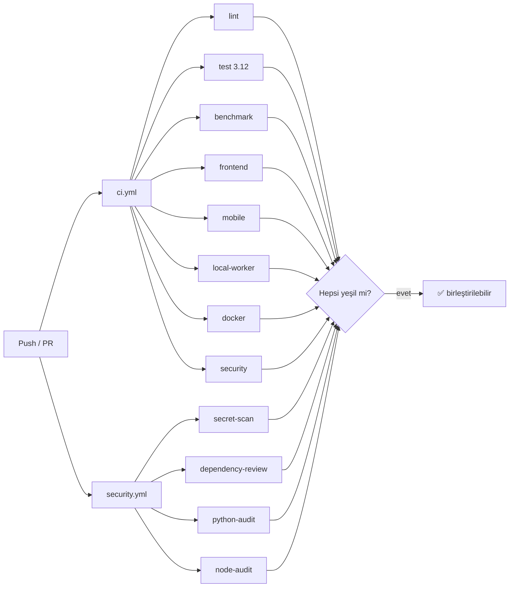
```mermaid
flowchart LR
    P[Push / PR] --> CI[ci.yml]
    P --> SEC[security.yml]
    CI --> L[lint]
    CI --> T[test 3.12]
    CI --> B[benchmark]
    CI --> F[frontend]
    CI --> M[mobile]
    CI --> LW[local-worker]
    CI --> D[docker]
    CI --> S[security]
    SEC --> SC[secret-scan]
    SEC --> DR[dependency-review]
    SEC --> PA[python-audit]
    SEC --> NA[node-audit]
    L & T & B & F & M & LW & D & S & SC & DR & PA & NA --> G{Hepsi yeşil mi?}
    G -->|evet| OK[✅ birleştirilebilir]
```

Her PR **12 kontrolden** geçer:

| İş akışı | Job'lar |
|----------|---------|
| `ci.yml` | `lint`, `test (3.12)`, `benchmark`, `frontend`, `mobile`, `local-worker`, `docker`, `security` |
| `security.yml` | `secret-scan` (Gitleaks), `dependency-review`, `python-audit` (pip-audit), `node-audit` (npm audit) |
| `build-local-worker.yml` | `build` — yalnızca elle tetiklenir (`workflow_dispatch`) |

---

## 🚀 16. Dağıtım

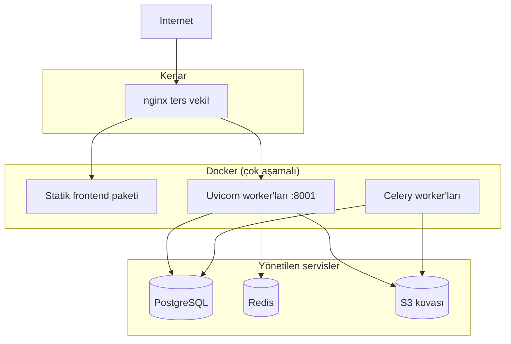
```mermaid
flowchart TD
    subgraph Kenar["Kenar"]
        N[nginx ters vekil]
    end
    subgraph App["Docker (çok aşamalı)"]
        FE[Statik frontend paketi]
        BE[Uvicorn worker'ları :8001]
        WK[Celery worker'ları]
    end
    subgraph Yonetilen["Yönetilen servisler"]
        PG[(PostgreSQL)]
        RDS[(Redis)]
        S3[(S3 kovası)]
    end
    Internet --> N
    N --> FE
    N --> BE
    BE --> PG & RDS & S3
    WK --> PG & S3
```

- **Çok aşamalı Docker** yapısı ince bir çalışma imajı üretir; frontend derlenip **nginx** arkasında statik varlık olarak sunulur. Konteyner **8001** portunu açar.
- Veritabanı göçleri sürüm çıkışında **Alembic** ile çalışır (`alembic upgrade head`).
- Depolama arka ucu değiştirilebilir (`STORAGE_BACKEND=local|s3`).
- Ayrıntılı kılavuzlar: [`docs/deploy.md`](docs/deploy.md), [`docs/aws-deploy.md`](docs/aws-deploy.md), [`docs/aws-edge-security.md`](docs/aws-edge-security.md), [`docs/backup-restore.md`](docs/backup-restore.md).

---

## 🗺️ 17. Yol haritası ve teknik borç

| Madde | Durum |
|-------|-------|
| Çoklu iş deneyimi bölme (alt bölüm başlıkları) | ✅ Çözüldü (iş başına kayıt) |
| Sayfa mobilyası / altbilgi gürültüsü temizliği | ✅ Çözüldü |
| Ayrıştırma kalitesi → AI yedeği kapısı | ✅ Eklendi (parçalanmış yerleşimleri LLM'e yönlendirir) |
| Tablo yerleşimli CV ayrıştırma | 🔶 Deterministik ayrıştırıcı zayıf; AI yedeğiyle kapatılıyor |
| Gömülü tarih bölme (`June 2024 to September 2024` → başlangıç/bitiş) | 🔶 Planlandı |
| Deneyim dışı bölümlerin (`Leadership Activities`) deneyime yönlenmesi | 🔶 Planlandı |
| `core/route_dependencies` eski değişebilir durum göçü | 🔶 Sürüyor |
| `datetime.utcnow()` → zaman dilimi farkındalıklı göç | 🔶 Beklemede |

---

## 🤝 18. Katkı ve lisans

### Katkı

1. **Dal aç** — `main` üzerinden (`feat/...`, `fix/...`, `refactor/...`).
2. **Önce test** — testleri yaz/ayarla; dokunulan kodda ≥%80 kapsam koru.
3. **Lint ve biçim** — `ruff check` + `ruff format` geçmeli.
4. **Kapsamlı commit'ler** — conventional commit biçimi (`feat:`, `fix:`, `refactor:`…); yalnızca ilgili dosyaları stage'le.
5. **PR** — inceleme istemeden önce 12 CI kontrolünün de yeşil olduğundan emin ol.

### Lisans

Bu proje **MIT Lisansı** ile yayımlanmıştır. Telif hakkı (c) 2026 Sercan Ozkan.

Yazılımı kullanma, kopyalama, değiştirme, birleştirme, yayımlama, dağıtma, alt lisanslama ve satma hakkınız vardır; tek koşul telif ve lisans bildiriminin korunmasıdır. Tam metin için [LICENSE](LICENSE) dosyasına bakın.

</details>

---

<details>
<summary><h2>🇬🇧 &nbsp;English Documentation &nbsp;<sub>(click to expand)</sub></h2></summary>

## 📑 Table of Contents

| # | Section | # | Section |
|---|---------|---|---------|
| 1 | [What is CV Analyzer](#-1-what-is-cv-analyzer) | 10 | [Data model](#-10-data-model) |
| 2 | [Feature matrix](#-2-feature-matrix) | 11 | [Security model](#-11-security-model) |
| 3 | [Quick start](#-3-quick-start) | 12 | [Environment variables](#-12-environment-variables) |
| 4 | [System architecture](#-4-system-architecture) | 13 | [Local development](#-13-local-development) |
| 5 | [Technology stack](#-5-technology-stack) | 14 | [Testing & quality gates](#-14-testing--quality-gates) |
| 6 | [Repository map](#-6-repository-map) | 15 | [CI/CD](#-15-cicd-1) |
| 7 | [Parsing pipeline](#-7-parsing-pipeline) | 16 | [Deployment](#-16-deployment) |
| 8 | [Request lifecycle](#-8-request-lifecycle) | 17 | [Roadmap & technical debt](#-17-roadmap--technical-debt) |
| 9 | [API surface](#-9-api-surface) | 18 | [Contributing & license](#-18-contributing--license) |

---

## 🧭 1. What is CV Analyzer

CV Analyzer **parses, scores, rewrites, and benchmarks résumés** against applicant-tracking-system (ATS) criteria.

The core design decision is **deterministic first, AI only when needed.** Rules and heuristics handle the bulk of résumés cheaply; the language model is invoked only when a confidence gate detects a low-quality parse. This keeps token spend proportional to difficulty.

The system is composed of **four cooperating runtimes** that share one domain model:

| Runtime | Technology | Responsibility |
|---------|-----------|----------------|
| 🖥️ **Backend API** | FastAPI (ASGI) | REST gateway, parsing pipeline, ATS scoring, billing, auth, quotas, storage, worker sync |
| 🌐 **Web portal** | React 18 + Vite | Landing, dashboards, analysis, CV Builder, recruiter workspace, billing UI |
| 📱 **Mobile client** | Expo React Native | Upload + history scaffold for on-the-go use |
| 🔐 **Local Worker** | PySide6 / Qt Quick (QML) | Offline batch processing on the user's own machine; explicit sync only |

The product direction is **hybrid SaaS + local privacy**: the cloud handles accounts, billing, recruiter collaboration, and shared workflows, while the Local Worker keeps sensitive batch processing on the user's machine until a sync is explicitly requested.

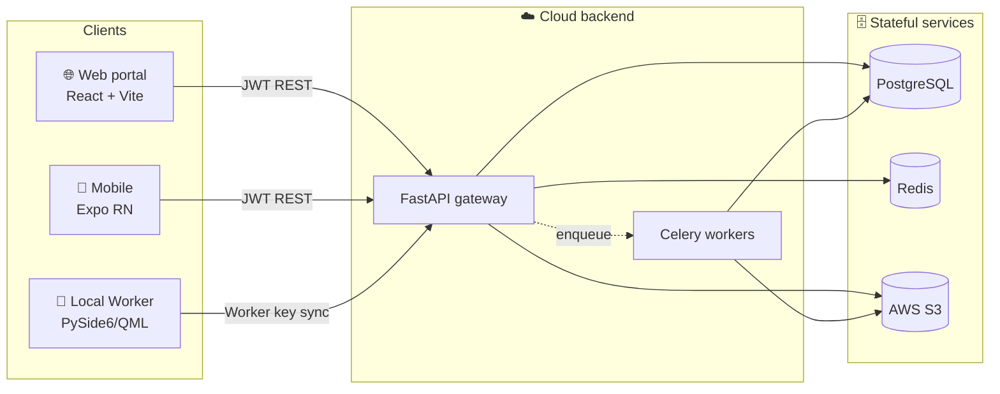
```mermaid
flowchart LR
    subgraph Clients
        W[🌐 Web portal<br/>React + Vite]
        M[📱 Mobile<br/>Expo RN]
        L[🔐 Local Worker<br/>PySide6/QML]
    end
    subgraph Cloud["☁️ Cloud backend"]
        API[FastAPI gateway]
        WK[Celery workers]
    end
    subgraph Data["🗄️ Stateful services"]
        DB[(PostgreSQL)]
        RD[(Redis)]
        S3[(AWS S3)]
    end
    W -->|JWT REST| API
    M -->|JWT REST| API
    L -->|Worker key sync| API
    API --> DB
    API --> RD
    API --> S3
    API -.enqueue.-> WK
    WK --> DB
    WK --> S3
```

---

## ✨ 2. Feature matrix

### 👤 Candidate / individual

| Feature | Description |
|---------|-------------|
| ATS analysis | Upload PDF/DOCX/TXT → overall + per-section ATS scores, detected/missing skills, recommendations |
| Score breakdown | Structure, keywords, experience, education, languages, ATS-friendliness, length |
| AI auto-fix | Deterministic résumé repair first; LLM rewrite only when parse quality is low or a rebuild is requested |
| CV Builder | Template-based generation (DOCX / PDF / HTML / Typst) with plan-gated templates and fonts |
| Cover letters & interview prep | LLM-assisted cover-letter, interview-question, and answer-evaluation tools |
| History & sharing | Persisted analyses, notes, favorites, shareable tokens |

### 🧑‍💼 Recruiter / hiring

| Feature | Description |
|---------|-------------|
| Jobs & batches | Create jobs, upload job descriptions, ingest candidate batches |
| Candidate ranking | Semantic + keyword match scoring, shortlist probability, strengths/concerns |
| Decisions & reports | Candidate actions, comments, reminders, exportable reports |
| Embeddings search | Index CVs, find similar candidates, semantic search |
| Local processing | Issue worker keys; process privately; sync selected results back |

### 🔐 Local desktop

| Feature | Description |
|---------|-------------|
| Folder batch | Process local folders of PDF/DOCX/TXT résumés offline-first |
| Local exports | CSV / JSON / HTML outputs stored in a local workspace |
| Credential safety | API keys stored in OS credential storage where available |
| Explicit sync | Results never leave the machine until the user syncs |

---

## 🚀 3. Quick start

> **Prerequisites:** Python 3.12, Node.js 20+, optionally PostgreSQL 15+ and Redis 7. For development, SQLite and local-disk storage are enough.

```bash
# 1) Clone
git clone https://github.com/SercanOzkan55/CV-Analyzer.git
cd CV-Analyzer

# 2) Prepare env
cp .env.example .env          # Windows: copy .env.example .env

# 3) Backend
python -m venv venv
source venv/bin/activate      # Windows: venv\Scripts\activate
pip install -r requirements.txt
alembic upgrade head
uvicorn main:app --reload --port 8001

# 4) Frontend (in a second terminal)
cd frontend
cp .env.example .env          # Windows: copy .env.example .env
npm install
npm run dev
```

The backend serves on `http://localhost:8001` and the web portal on `http://localhost:3000`.

> ⚠️ **Port 8001 is required.** The frontend's Vite proxy forwards `/api` to `http://127.0.0.1:8001` (`frontend/vite.config.mjs`), and the `Dockerfile` exposes 8001. Running the backend on any other port breaks every API call from the UI.

---

## 🏗️ 4. System architecture

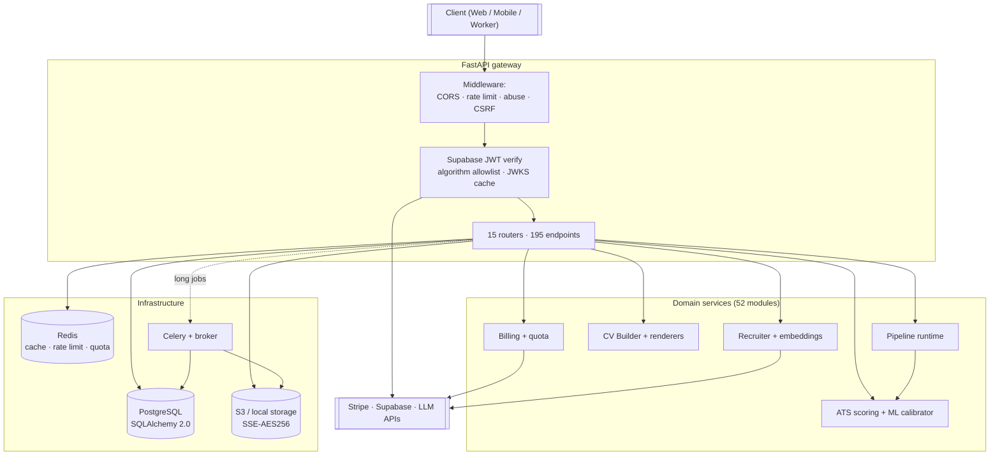
```mermaid
flowchart TD
    Client[["Client (Web / Mobile / Worker)"]]

    subgraph Gateway["FastAPI gateway"]
        MW[Middleware:<br/>CORS · rate limit · abuse · CSRF]
        AUTH[Supabase JWT verify<br/>algorithm allowlist · JWKS cache]
        ROUTE[15 routers · 195 endpoints]
    end

    subgraph Domain["Domain services (52 modules)"]
        PIPE[Pipeline runtime]
        ATS[ATS scoring + ML calibrator]
        BUILD[CV Builder + renderers]
        REC[Recruiter + embeddings]
        BILL[Billing + quota]
    end

    subgraph Infra["Infrastructure"]
        DB[(PostgreSQL<br/>SQLAlchemy 2.0)]
        RD[(Redis<br/>cache · rate limit · quota)]
        S3[(S3 / local storage<br/>SSE-AES256)]
        CEL[Celery + broker]
    end

    EXT[[Stripe · Supabase · LLM APIs]]

    Client --> MW --> AUTH --> ROUTE
    ROUTE --> PIPE & ATS & BUILD & REC & BILL
    PIPE --> ATS
    BILL --> EXT
    AUTH --> EXT
    ROUTE --> DB & RD & S3
    ROUTE -.long jobs.-> CEL --> DB & S3
    REC --> EXT
```

### Design patterns in play

| Pattern | Where |
|---------|-------|
| **Repository / service layer** | `services/*` encapsulate data access + business logic behind route handlers |
| **Factory** | `ai_client_factory`; extraction handler selection by file type / layout |
| **Strategy** | Storage adapter (local vs S3), fix mode (preserve / light-fix / rebuild) |
| **Singleton** | DB session factory, Redis clients, loaded ML models, runtime settings |
| **Pipeline** | `extract → normalize → schema → validate → score` staged transform |
| **Circuit breaker / kill-switch** | `core/ops_runtime`, `shared._cb_*` guard external dependencies |

---

## 🧰 5. Technology stack

### Backend

| Layer | Library | Version |
|-------|---------|---------|
| Web framework | FastAPI | `0.135.1` |
| ASGI server | Uvicorn | `0.42.0` |
| ORM | SQLAlchemy | `2.0.47` |
| Migrations | Alembic | `1.18.4` |
| Validation | Pydantic | `2.12.5` |
| Task queue | Celery | `5.6.2` |
| Cache / limits | redis-py | `7.2.1` |
| Object storage | boto3 (S3) | `1.42.73` |
| PDF extraction | pdfplumber / pypdf / pypdfium2 | `0.11.9` / `6.16.2` / `5.6.0` |
| ML scoring | scikit-learn / XGBoost / NumPy | `1.8.0` / `3.2.0` / `2.4.2` |
| JWT | PyJWT | `2.13.0` |
| DB driver | psycopg2-binary | `2.9.11` |

### Frontend / mobile / desktop

| Layer | Library | Version |
|-------|---------|---------|
| UI library | React | `18.2` |
| Build tool | Vite | `8.0` |
| Styling | Tailwind CSS | `4.3` |
| Animation | Framer Motion | `12.36` |
| Routing | React Router DOM | `6.21` |
| Auth client | Supabase JS | `2.39` |
| Testing | Vitest + Testing Library | `4.1` |
| Mobile | Expo / React Native | — |
| Desktop | PySide6 (Qt Quick / QML) | — |

---

## 🗂️ 6. Repository map

```text
CV-Analyzer/
├── main.py                 # FastAPI app bootstrap (routers, middleware, lifespan)
├── routes/                 # 15 routers, 195 endpoints
│   ├── analysis.py         #   ATS analyze (sync/async/pdf), ownership
│   ├── ai_tools.py         #   auto-fix, rewrite, cover letter, interview, embeddings
│   ├── cv_builder.py       #   templates, preview, generate, suggest-summary
│   ├── cv_storage.py       #   S3 upload/download/delete, score breakdown
│   ├── billing.py          #   Stripe checkout, webhooks, admin ops
│   ├── recruiter*.py       #   jobs, candidates, ranking, local sync (3 files)
│   ├── dashboard.py        #   usage, plan, stats
│   ├── user_data.py        #   user data, export, deletion (GDPR)
│   ├── owner_workflow.py   #   owner / operator workflows
│   ├── worker.py           #   local-worker claim/sync
│   ├── downloads.py        #   generated-file downloads
│   ├── blog.py             #   blog content (feature-flagged off)
│   └── system.py           #   health, readiness, ops
├── services/               # 52 domain services (see §7)
│   ├── pdf_text_extractor.py   # layout-aware PDF → text
│   ├── section_classifier.py   # language-agnostic section detection
│   ├── schema_builder.py       # normalized data → strict CVSchema
│   ├── extraction_validator.py # parse-quality gate → AI fallback
│   ├── cv_autofix_service.py   # deterministic repair + AI rewrite orchestration
│   ├── ats_scoring.py          # section + overall ATS scoring
│   └── ...
├── agents/                 # extract_agent, normalize_agent (pipeline stages)
├── core/                   # http_runtime, ops_runtime, quota, metrics, route_dependencies
├── models.py               # 35 SQLAlchemy models
├── schemas/                # Pydantic + CVSchema / CVModel
├── renderers/              # DOCX / PDF / HTML / Typst template engines
├── security/               # file_guard, s3_guard, rate_limit, runtime_guard
├── middleware/             # request middleware
├── alembic/ · migrations/  # DB migrations
├── frontend/               # React + Vite web portal
├── mobile/                 # Expo React Native scaffold
├── local_worker/           # PySide6 desktop app
├── tests/                  # 125 test files, 981 tests, golden fixtures
└── .github/workflows/      # CI: ci.yml · security.yml · build-local-worker.yml
```

---

## ⚙️ 7. Parsing pipeline

The parsing core is **deterministic-first**. The LLM is invoked **only** when a confidence gate detects a low-quality parse.

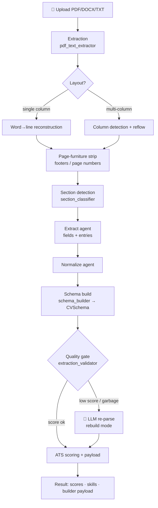
```mermaid
flowchart TD
    A[📄 Upload PDF/DOCX/TXT] --> B[Extraction<br/>pdf_text_extractor]
    B --> B1{Layout?}
    B1 -->|single column| C[Word→line reconstruction]
    B1 -->|multi-column| C2[Column detection + reflow]
    C --> D[Page-furniture strip<br/>footers / page numbers]
    C2 --> D
    D --> E[Section detection<br/>section_classifier]
    E --> F[Extract agent<br/>fields + entries]
    F --> G[Normalize agent]
    G --> H[Schema build<br/>schema_builder → CVSchema]
    H --> I{Quality gate<br/>extraction_validator}
    I -->|score ok| K[ATS scoring + payload]
    I -->|low score / garbage| J[🤖 LLM re-parse<br/>rebuild mode]
    J --> K
    K --> L[Result: scores · skills · builder payload]
```

### Pipeline stages & key services

| Stage | Service(s) | What it does |
|-------|-----------|--------------|
| **Extract** | `pdf_text_extractor` | Font-relative word tolerance (`x_tolerance_ratio`) so tightly-spaced PDFs don't glue words; multi-column detection & reflow; mojibake repair; **page-furniture stripping** (footers / `Page N` / template credits) |
| **Classify** | `section_classifier`, `section_resolver` | Language-agnostic section detection via aliases + structural signals; qualifier-aware headers (`Research Experience`, `Other Work Experience`) |
| **Extract fields** | `agents/extract_agent` | Splits contact, summary, experiences (one entry per job), education, skills, projects, certifications, languages |
| **Normalize** | `agents/normalize_agent` | Canonicalizes dates, bullets, casing, ordering |
| **Schema** | `schema_builder` | Maps normalized data into a strict `CVSchema`; bullet-glyph normalization (`●○◦…`); routes spoken languages to the languages field; drops substance-less entries |
| **Validate** | `extraction_validator` | **Quality gate** — detects garbage parses (fragment titles, over-split tables, lost sections, garbage skills) and flips `needs_llm_fallback` |
| **Score** | `ats_scoring`, `ml_calibrator`, `scoring_service` | Per-section + overall ATS scores; ML calibration with confidence |
| **Build** | `cv_builder_service`, `renderers/*` | Template rendering to DOCX / PDF / HTML / Typst |

### Robustness highlights

| Problem | Fix |
|---------|-----|
| Glued words in tight PDFs (`BachelorofScience`) | Font-relative `x_tolerance_ratio` word splitting |
| `●`-bulleted jobs collapsing into one entry | Added `●○◦` + glyphs to all bullet regexes → correct per-job splitting |
| Page footers becoming fake jobs | Page-furniture stripping at extraction time |
| Spoken languages stuck in skills | Language-name / CEFR-gated routing into the languages field |
| Table & non-standard layouts shredding into garbage | **Fragmentation quality gate** routes them to LLM re-parse |

---

## 🔄 8. Request lifecycle

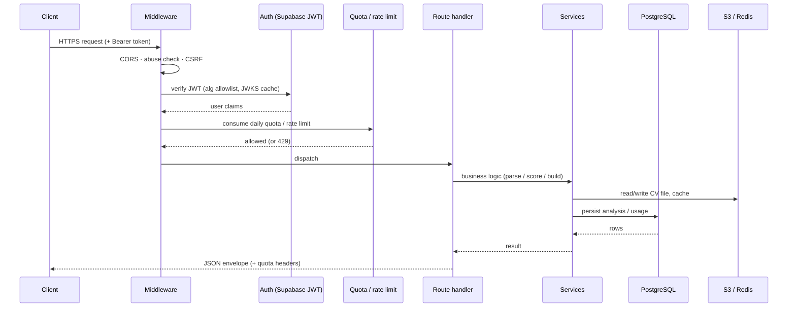
```mermaid
sequenceDiagram
    participant U as Client
    participant MW as Middleware
    participant A as Auth (Supabase JWT)
    participant Q as Quota / rate limit
    participant R as Route handler
    participant S as Services
    participant DB as PostgreSQL
    participant X as S3 / Redis

    U->>MW: HTTPS request (+ Bearer token)
    MW->>MW: CORS · abuse check · CSRF
    MW->>A: verify JWT (alg allowlist, JWKS cache)
    A-->>MW: user claims
    MW->>Q: consume daily quota / rate limit
    Q-->>MW: allowed (or 429)
    MW->>R: dispatch
    R->>S: business logic (parse / score / build)
    S->>X: read/write CV file, cache
    S->>DB: persist analysis / usage
    DB-->>S: rows
    S-->>R: result
    R-->>U: JSON envelope (+ quota headers)
```

---

## 🌐 9. API surface

**15 routers, 195 endpoints**, all under `/api/v1`.

| Router | Endpoints | Purpose |
|--------|----------:|---------|
| `recruiter` | 26 | Recruiter workspace: jobs, candidates, ranking, reports |
| `ai_tools` | 24 | Auto-fix, rewrite, cover letter, interview, semantic search, embeddings |
| `dashboard` | 21 | Usage, plan, statistics |
| `worker` | 19 | Local Worker claim / sync |
| `owner_workflow` | 18 | Owner and operator workflows |
| `user_data` | 15 | User data, export, deletion (GDPR) |
| `system` | 15 | Health, readiness, ops endpoints |
| `billing` | 14 | Stripe checkout, webhooks, admin operations |
| `analysis` | 13 | ATS analysis (sync, async, file) |
| `recruiter_local` | 9 | Recruiter-side local-processing bridge |
| `cv_builder` | 6 | Template-based CV generation |
| `cv_storage` | 5 | S3 CV storage + score breakdown |
| `blog` | 5 | Blog content (off via `VITE_ENABLE_BLOG`) |
| `recruiter_extended` | 3 | Extended recruiter operations |
| `downloads` | 2 | Generated-file downloads |

> Responses use a consistent envelope (status, data, error, optional pagination meta) and carry quota headers.

---

## 🗃️ 10. Data model

35 SQLAlchemy models. Core relationships:

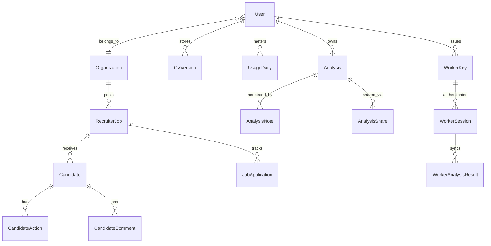
```mermaid
erDiagram
    User ||--o{ Analysis : owns
    User ||--o{ CVVersion : stores
    User ||--o{ UsageDaily : meters
    User }o--|| Organization : belongs_to
    Organization ||--o{ RecruiterJob : posts
    RecruiterJob ||--o{ Candidate : receives
    RecruiterJob ||--o{ JobApplication : tracks
    Candidate ||--o{ CandidateAction : has
    Candidate ||--o{ CandidateComment : has
    Analysis ||--o{ AnalysisNote : annotated_by
    Analysis ||--o{ AnalysisShare : shared_via
    User ||--o{ WorkerKey : issues
    WorkerKey ||--o{ WorkerSession : authenticates
    WorkerSession ||--o{ WorkerAnalysisResult : syncs
```

| Domain | Models |
|--------|--------|
| Accounts & billing | `User`, `Organization`, `APISubscription`, `RolePermission`, `QuotaEvent`, `UsageDaily` |
| Analysis | `Analysis`, `CVVersion`, `AnalysisNote`, `AnalysisShare`, `Favorite` |
| Recruiter | `RecruiterJob`, `Candidate`, `Job`, `JobApplication`, `CandidateAction`, `CandidateComment`, `Reminder`, `JobTemplate`, `EmailTemplate` |
| Benchmarks | `ATSBenchmarkGlobal`, `ATSBenchmarkProfession`, `ATSBenchmarkScore` |
| Local worker | `WorkerKey`, `WorkerSession`, `WorkerClaim`, `WorkerAnalysisResult` |
| Ops | `AuditLog`, `FailedTask`, `AsyncTaskOwner` |

---

## 🛡️ 11. Security model

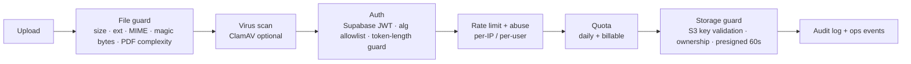
```mermaid
flowchart LR
    A[Upload] --> B[File guard<br/>size · ext · MIME · magic bytes · PDF complexity]
    B --> C[Virus scan<br/>ClamAV optional]
    C --> D[Auth<br/>Supabase JWT · alg allowlist · token-length guard]
    D --> E[Rate limit + abuse<br/>per-IP / per-user]
    E --> F[Quota<br/>daily + billable]
    F --> G[Storage guard<br/>S3 key validation · ownership · presigned 60s]
    G --> H[Audit log + ops events]
```

| Layer | Control |
|-------|---------|
| Input | File size/extension/MIME/magic-byte validation, PDF complexity limits, optional ClamAV |
| Auth | Supabase JWT with algorithm allowlist, JWKS caching, token-length guard |
| Abuse | Per-IP & per-user rate limits, abuse bans, duplicate-request dedup |
| Quota | Daily + monthly plan limits, billable usage metering, cost guards |
| Storage | S3 SSE-AES256, key-format validation, ownership enforcement, 60s presigned URLs |
| Secrets | Env-var / secret-manager only; **Gitleaks** secret scan in CI |
| Supply chain | `pip-audit` + `npm audit` (root/frontend/mobile) + Dependency Review in CI |
| Billing | Stripe webhook HMAC signature verification |

---

## 🔑 12. Environment variables

`.env.example` defines **176 variables** — see that file for the full list and defaults. Never commit secrets; required values are validated at startup.

### Backend (`.env`)

| Group | Sample variables | Purpose |
|-------|------------------|---------|
| Core | `PORT`, `ENV`, `APP_TIMEZONE`, `BUILD_ID`, `GIT_SHA` | Runtime identity and metadata |
| Database | `DATABASE_URL` | PostgreSQL connection (SQLite for dev) |
| Cache | `REDIS_URL` | Cache, rate limiting, quota counters |
| Auth | `SUPABASE_URL`, `SUPABASE_JWT_*` | JWT verification / JWKS |
| Billing | `STRIPE_API_KEY`, `STRIPE_WEBHOOK_SECRET`, `BILLING_ADMIN_TOKEN` | Stripe and webhook verification |
| Storage | `STORAGE_BACKEND`, `AWS_*`, `S3_BUCKET`, `AWS_USE_IAM_ROLE` | Object storage (`s3` or `local`) |
| Rate limits | `RATE_LIMIT_IP_*`, `RATE_LIMIT_USER_*`, `ADMIN_RATE_LIMIT_PER_MIN` | Request ceilings |
| Abuse | `ABUSE_PROTECTION_ENABLED`, `ABUSE_BAN_SECONDS`, `ABUSE_SCORE_*` | Abuse detection and bans |
| Quota / plans | `ENTITLE_FREE_DAILY_CV`, `ENTITLE_PRO_DAILY_CV`, `ENTITLE_ENTERPRISE_DAILY_CV`, `AUTO_NEW_USER_PLAN` | Plan entitlements |
| Concurrency | `CONCURRENCY_ANALYZE`, `CONCURRENCY_EMBED`, `CONCURRENCY_REWRITE`, … | Per-stage concurrency caps |
| AI | `AI_TIMEOUT_SECONDS`, `AI_MAX_RETRIES`, `ENABLE_AI_REVIEW`, `AI_FINAL_REVIEW_ATS_THRESHOLD` | LLM behavior and cost guards |
| ATS | `ATS_MODEL_PATH`, `ATS_CONFIG_PATH`, `ATS_WEIGHT`, `ENABLE_CLASSIFIER` | Scoring model and weights |
| Retention | `CV_RETENTION_DAYS`, `CV_RETENTION_BATCH_LIMIT`, `CV_VERSION_TEXT_STORAGE_MODE` | Data retention policy |
| Security toggles | `CSRF_PROTECTION_ENABLED`, `CLAMAV_ENABLED`, `ADMIN_TOKEN`, `ADMIN_IP_ALLOWLIST` | Security switches |
| Backups | `BACKUP_DIR`, `BACKUP_RETENTION_DAYS`, `BACKUP_S3_PREFIX` | Backup jobs |
| Circuit breaker | `CB_FAILURE_THRESHOLD`, `CB_COOLDOWN_SECONDS` | External-dependency protection |

### Frontend (`frontend/.env`)

| Variable | Purpose |
|----------|---------|
| `VITE_API_BASE` | Backend base URL (production) |
| `VITE_SUPABASE_URL`, `VITE_SUPABASE_KEY` | Supabase client credentials |
| `VITE_PRIVATE_MODE` | Locks the site behind login, disables registration |
| `VITE_REGISTRATION_DISABLED` | Disables registration independently |
| `VITE_ENABLE_BLOG` | Blog is localStorage-only demo content — keep off until it has a real backend |
| `VITE_ENABLE_BILLING` | Checkout and billing portal stay hidden until Stripe production is ready |

---

## 💻 13. Local development

### Backend

```bash
python -m venv venv && source venv/bin/activate   # Windows: venv\Scripts\activate
pip install -r requirements.txt
alembic upgrade head
uvicorn main:app --reload --port 8001
```

### Frontend

```bash
cd frontend
npm install
npm run dev          # Vite dev server (port 3000)
npm run build        # production bundle + SEO prerender
npm run preview      # serve the production bundle locally
```

### Background workers (optional)

```bash
celery -A services.tasks worker --loglevel=info
```

### Local Worker (desktop)

```bash
cd local_worker
pip install -r requirements.txt
python main.py       # PySide6 / Qt Quick app
```

---

## 🧪 14. Testing & quality gates

| Suite | Command | Coverage |
|-------|---------|----------|
| Backend | `pytest tests/ -q` | **981 tests** across 125 files: parsing, scoring, schema, security, tenancy, billing |
| Golden CVs | `pytest tests/golden/` | Regression fixtures for known résumé shapes |
| Frontend | `cd frontend && npm test` | **129 tests** across 24 files (Vitest + Testing Library) |
| Frontend types | `cd frontend && npm run typecheck` | `tsc --noEmit` |
| Lint | `ruff check . --select E9,F63,F7,F82` | Syntax / undefined-name gate |
| Format | `ruff format --check .` | Code style |

---

## 🔁 15. CI/CD

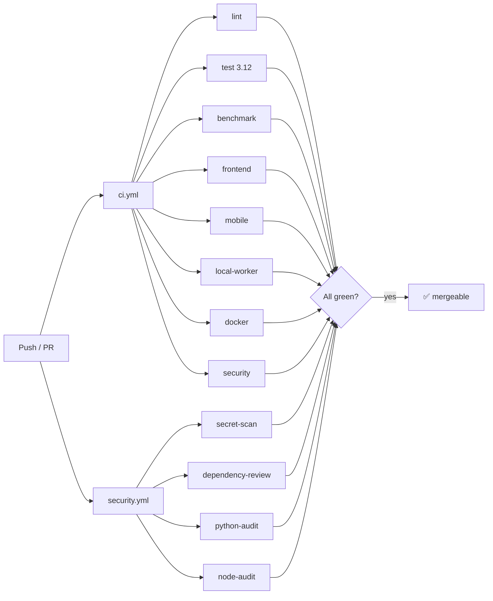
```mermaid
flowchart LR
    P[Push / PR] --> CI[ci.yml]
    P --> SEC[security.yml]
    CI --> L[lint]
    CI --> T[test 3.12]
    CI --> B[benchmark]
    CI --> F[frontend]
    CI --> M[mobile]
    CI --> LW[local-worker]
    CI --> D[docker]
    CI --> S[security]
    SEC --> SC[secret-scan]
    SEC --> DR[dependency-review]
    SEC --> PA[python-audit]
    SEC --> NA[node-audit]
    L & T & B & F & M & LW & D & S & SC & DR & PA & NA --> G{All green?}
    G -->|yes| OK[✅ mergeable]
```

Every PR is gated by **12 checks**:

| Workflow | Jobs |
|----------|------|
| `ci.yml` | `lint`, `test (3.12)`, `benchmark`, `frontend`, `mobile`, `local-worker`, `docker`, `security` |
| `security.yml` | `secret-scan` (Gitleaks), `dependency-review`, `python-audit` (pip-audit), `node-audit` (npm audit) |
| `build-local-worker.yml` | `build` — manual only (`workflow_dispatch`) |

---

## 🚀 16. Deployment

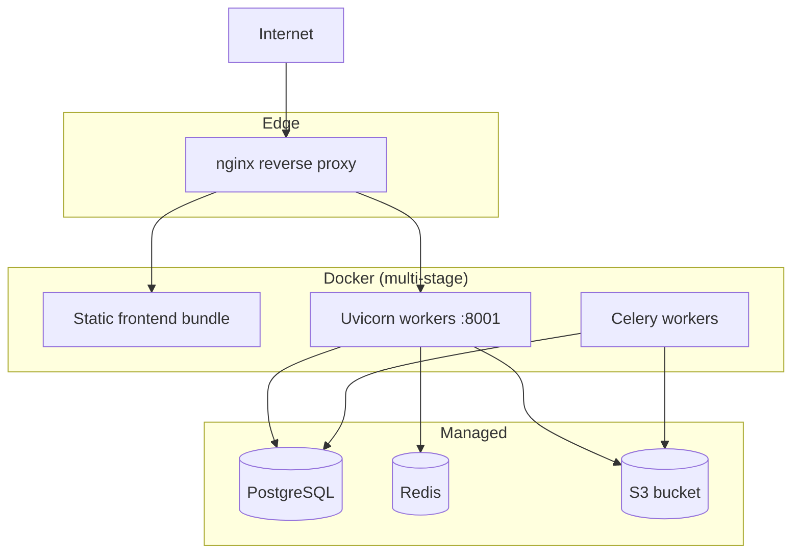
```mermaid
flowchart TD
    subgraph Edge
        N[nginx reverse proxy]
    end
    subgraph App["Docker (multi-stage)"]
        FE[Static frontend bundle]
        BE[Uvicorn workers :8001]
        WK[Celery workers]
    end
    subgraph Managed
        PG[(PostgreSQL)]
        RDS[(Redis)]
        S3[(S3 bucket)]
    end
    Internet --> N
    N --> FE
    N --> BE
    BE --> PG & RDS & S3
    WK --> PG & S3
```

- **Multi-stage Docker** build produces a slim runtime image; the frontend is built and served as static assets behind **nginx**. The container exposes port **8001**.
- Database migrations run via **Alembic** (`alembic upgrade head`) on release.
- Storage backend is swappable (`STORAGE_BACKEND=local|s3`).
- Detailed guides: [`docs/deploy.md`](docs/deploy.md), [`docs/aws-deploy.md`](docs/aws-deploy.md), [`docs/aws-edge-security.md`](docs/aws-edge-security.md), [`docs/backup-restore.md`](docs/backup-restore.md).

---

## 🗺️ 17. Roadmap & technical debt

| Item | Status |
|------|--------|
| Multi-job experience splitting (sub-section headers) | ✅ Fixed (per-job entries) |
| Page-furniture / footer noise removal | ✅ Fixed |
| Parse-quality → AI fallback gate | ✅ Added (routes shredded layouts to LLM) |
| Table-layout CV parsing | 🔶 Deterministic parser weak; covered via AI fallback |
| Embedded date splitting (`June 2024 to September 2024` → start/end) | 🔶 Planned |
| Non-experience sections (`Leadership Activities`) routed into experience | 🔶 Planned |
| `core/route_dependencies` legacy mutable-state migration | 🔶 In progress |
| `datetime.utcnow()` → timezone-aware migration | 🔶 Backlog |

---

## 🤝 18. Contributing & license

### Contributing

1. **Branch** off `main` (`feat/...`, `fix/...`, `refactor/...`).
2. **TDD** — write/adjust tests first; keep ≥80% coverage on touched code.
3. **Lint & format** — `ruff check` + `ruff format` must pass.
4. **Scoped commits** — conventional-commit style (`feat:`, `fix:`, `refactor:`…); stage only related files.
5. **PR** — ensure all 12 CI checks are green before requesting review.

### License

Released under the **MIT License**. Copyright (c) 2026 Sercan Ozkan.

You are free to use, copy, modify, merge, publish, distribute, sublicense, and sell the software, provided the copyright and license notice is preserved. See [LICENSE](LICENSE) for the full text.

</details>

---

<div align="center">

**CV Analyzer** — mümkün olan yerde deterministik, gerekli olan yerde yapay zekâ.
<br/>
*deterministic where it can be, AI where it must be.*

</div>
